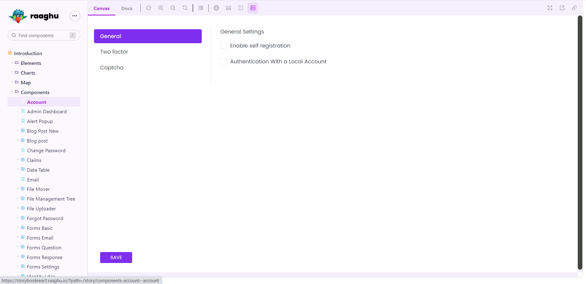

COMPONENTS
==========

Elemnets and Components used in abp-raaghu-react are reusable and if you want to use the components in any module, one can refer to the list of the components used in the storybook link [https://storybookreact.raaghu.io/](https://storybookreact.raaghu.io/)



### Storybook 

Through the **storybook** you can visualize and navigate around the features of the raaghu. Snippets for the elements allow you to test and design your UI faster and efficiently.

You can further customize and extend Storybook to suit your project's needs. The .storybook directory will contain configuration files, and you can customize Storybook's appearance, add addons, and more.

In Storybook, components are often organized into "stories" to showcase their different states, variations, and use cases. Storybook provides a way to visually document and test your components in isolation. Button elements are a common example for creating stories in Storybook.

 create the stoires file for perticular elements uisng filename.stories.
 stotybook provide by default code in file creation.

```json
import React from 'react';
import { Story, Meta } from '@storybook/react';

import MyComponent from './MyComponent'; // Import your component

export default {
  title: 'MyComponent',
  component: MyComponent,
} as Meta;

const Template: Story = (args) => <MyComponent {...args} />;

export const Default = Template.bind({});
Default.args = {
  // Add default props here
};
```
 
So take the example as button element. create the **button.stories** file.

 

Replace MyComponent with the actual name of your component. This example assumes your component is named MyComponent.

Run Storybook, and you should see your component story in the Storybook UI.

Add more stories as needed for other components in your project.

That's it! You now have a Storybook set up with React and TypeScript, and you can use it to document and showcase your components. Make sure to customize the Storybook configurations and your

Those are the control and action passing thoeugh the argTypes, here is example for button element.

```json
export default {
    title: "Elements/Button",
    component: RdsButton,
    argTypes: {
        colorVariant: {
            options: [
                "primary",
                "secondary",
                "success",
                "info",
                "warning",
                "danger",
                "dark",
                "light",
            ],
            control: { type: "select" },
        },
        size: {
            options: ["small", "medium", "large"],
            control: { type: "select" },
        },
        tooltipPlacement: {
            options: ["top", "bottom", "right", "left"],
            control: { type: "radio" },
            if: { arg: 'tooltip' }
        },
    },
} as ComponentMeta<typeof RdsButton>;

const Template: ComponentStory<typeof RdsButton> = (args) => (
    <RdsButton {...args} />
);
```

create the multiple stoires for button elements.

Default state of button shoing in below 
```json
export const Default = Template.bind({});
Default.args = {
    colorVariant: "primary",
    label: "BUTTON",
    block: false,
    size: "medium",
    showLoadingSpinner:true,
};
```

Disbaled state of button shoing in below
```json
export const Disable = Template.bind({});
Disable.args = {
    colorVariant: "primary",
    label: "Disable",
    isDisabled: true,
    block: false,
    size: "medium",
};
```

There is control pannel in storybook UI. It will show the multiple control.


