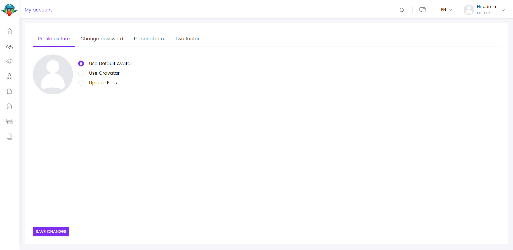

CUSTOMIZATION
-------------

### Manage Profile Page Tabs

Under the My Account on clicking the dropdown of host admin profile, you get 4 tabs as Profile Picture, Change Password, Personal Info and Two factor

The tabs in the manage profile page can be managed via ManageProfileTabsService which is exposed by the @volo/abp.ng.account/public/config package. You can add, remove, or edit a tab with using this service.

