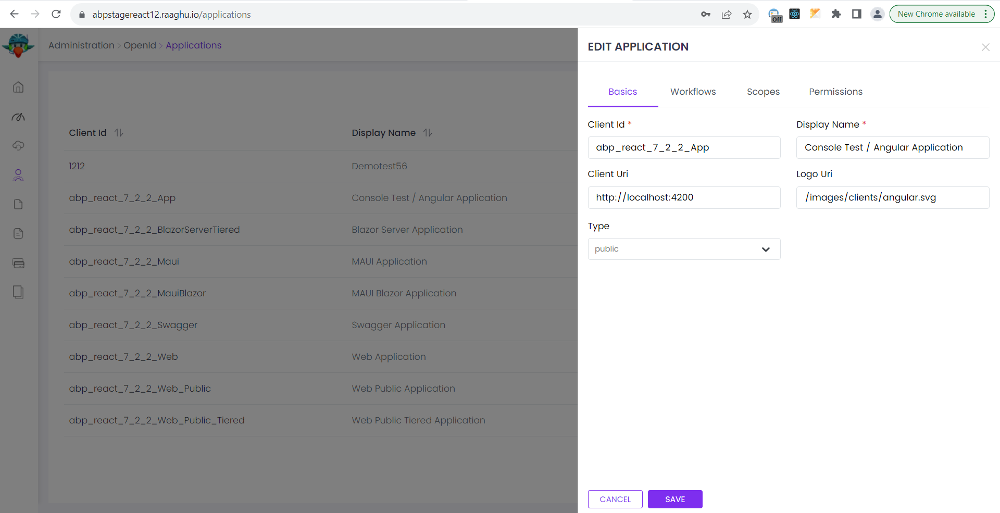

OpenIddict Module
=================

This module provides integration and management functionality for the OpenIddict library;

* Built on the [OpenIddict-core](https://github.com/openiddict/openiddict-core) library.
* Manage **Application** and **API scopes** in the system.
* Set **permissions** for clients.

See [the module description page](https://commercial.abp.io/modules/Volo.OpenIddict) for an overview of the module features.

User Interface
--------------

### Menu Items

The OpenIddict module adds the following items to the "Main" menu, under the "Administration" menu item:

* **Applications**: Application management page.
* **Scopes**: Scope management page.

OpenIddictProMenus class has the constants for the menu item names.

Pages
-----

Application Management

Applications page is used to manage OpenIddict applications. An application represent hosted applications that can request tokens from your authentication server.

You can create new application or edit existing applications in this page:

 

API Scope Management

OpenIddict module allows to manage API scope. To allow applications to request access tokens for APIs, you need to define API scopes.

You can create a new API resource or edit an existing API resource in this page:

