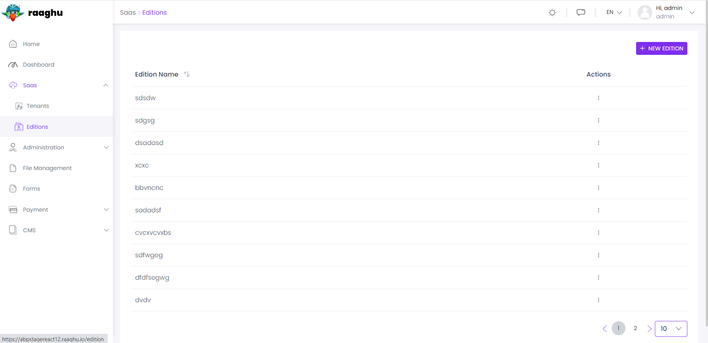
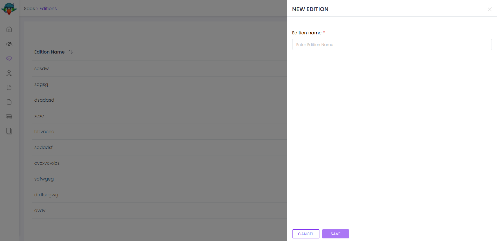

This module is used to manage your tenants and editions in multi-tenant applications;

* Manage **tenants** and **editions** in the system. A tenant is allowed to have one edition.
* Set **features** of tenants.
* Set **connection string** of tenants.
* Set **features** of editions and tenants.

See [the module description page](https://commercial.abp.io/modules/Volo.Saas) for an overview of the module features.

Packages
--------

This module follows the [module development best practices guide](https://docs.abp.io/en/abp/latest/Best-Practices/Index) and consists of several NuGet and NPM packages. See the guide if you want to understand the packages and relations between them.

You can visit [SaaS module package list page](https://abp.io/packages?moduleName=Volo.Saas) to see list of packages related with this module.

### Tenant-Edition Subscription

SaaS module implements subscribing to Editions for Tenants using Payment module. To enable it, project must contain Volo.Saas and Volo.Payment modules and these modules must be configured as shown below.

### Configuration

Firstly, Payment module must be configured properly:

* Install Volo.Payment module.
```shell
  abp add-module Volo.Payment
```

Or you can install via using ABP Suite.

* Configure Saas module to use Payment.
```json
  Configure(options =>
  {
  options.IsPaymentSupported = true;
  });
```

* Follow the [subscriptions](https://docs.abp.io/en/commercial/7.0/modules/payment#subscriptions) section of [Payment Module Documentation](https://docs.abp.io/en/commercial/7.0/modules/payment#subscriptions). Complete [enabling webhooks](https://docs.abp.io/en/commercial/7.0/modules/payment#enabling-webhooks) and [configuring plans](https://docs.abp.io/en/commercial/7.0/modules/payment#configuring-plans) sections.
* Run the application and go to Saas > Editions page at your Web Application menu.
* Create or Edit an existing Edition. **Plan** dropdown must be visible if you've done earlier steps correctly. Pick a Plan for Edition.

### Usage

SaaS module doesn't contain a public facing list page for listing editions for new customers/tenants to subscribe. First, you need to create such a page in your application. Then, when a new customer/tenant selects one of those Editions, you can create a subscription and redirect user to payment module as shown below.

* Inject ISubscriptionAppService to create a subscription for a edition:
```json
  public class IndexModel : PageModel
  {
  protected ISubscriptionAppService SubscriptionAppService { get; }

  protected ICurrentTenant CurrentTenant { get; }

  public IndexModel(
  ISubscriptionAppService subscriptionAppService,
  ICurrentTenant currentTenant)
  {
  SubscriptionAppService = subscriptionAppService;
  CurrentTenant = currentTenant;
  }

  public async Task OnPostAsync(Guid editionId)
  {
  var paymentRequest = await SubscriptionAppService.CreateSubscriptionAsync(editionId, CurrentTenant.GetId());

  return LocalRedirectPreserveMethod("/Payment/GatewaySelection?paymentRequestId=" + paymentRequest.Id);
  }
  }
```
When the payment is completed successfully, the tenant and edition relation will be updated according to subscription status. Make sure Payment Gateway Web Hooks are configured properly.

After all, payment module will redirect user to the callbackUrl if configured in [payment configuration](https://docs.abp.io/en/commercial/7.0/modules/payment#paymentweboptions) with a paymentRequestId parameter. In this page, you can check the status of the payment request and show a success message to the user when the payment status is confirmed. Since the payment confirmation is asynchronous, you need to check the payment status repeatedly until it is confirmed.

### User interface

#### Menu items

SaaS module adds the following items to the "Main" menu, under the "Administration" menu item:

* **Tenants**: Tenant management page.
* **Editions**: Edition management page.

SaasHostMenuNames and SaasTenantMenuNames classes have the constants for the menu item names.

### Pages

Tenant management

Tenant page is used to manage tenants in the system.


You can create a new tenant or edit a tenant in this page:


### Connection String

You can manage connection string of a tenant in case you want to use a separate database for a specific tenant. If you want to use Host database for a tenant, select "Use the Shared Database" option.

You can also use the module-specific database connection string feature. In this case, you should select the "Use module specific database connection string" option, then you can determine your modules and their connection strings. Before adding you can check your connection by clicking "Check"

### Tenant Features

You can set features of tenants.


Edition management

Editions page is used to manage the editions in your system.



You can create a new edition or edit an existing edition in this page:



### Edition Features

You can set features of an edition in this page:


