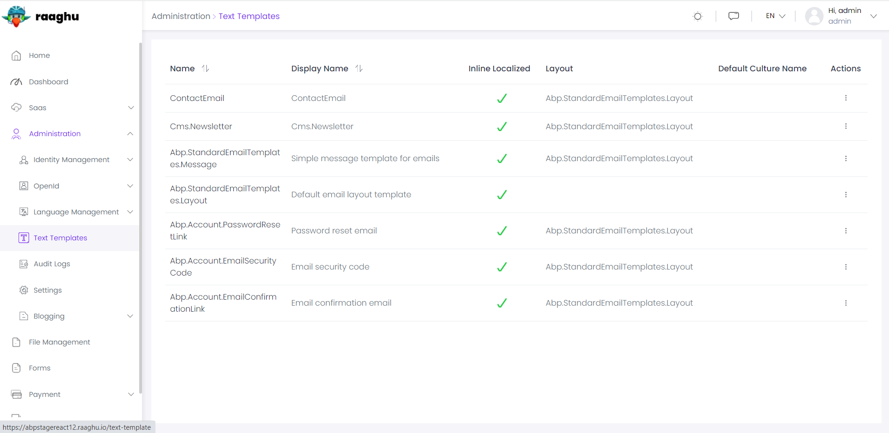

Text Template Management Module
===============================

This module is used to store and edit template contents for [the text templating system](https://docs.abp.io/en/abp/latest/Text-Templating) of the ABP framework. So, you may need to understand it to better understand the purpose of this module.

There are different use cases of the text templating system. For example, [the Account Module](https://docs.abp.io/en/commercial/7.0/modules/Account) is using it to define templates for sending emails when it needs to send emails to users (like sending "password reset link" email). This module provides UI to easily edit these email templates.

See [the module description page](https://commercial.abp.io/modules/Volo.TextTemplateManagement) for an overview of the module features.

User Interface
--------------

### Menu Items

Text Template Management module adds the following items to the "Main" menu, under the "Administration" menu item:

* **Text Templates**: List, view and filter text templates.

TextTemplateManagementMainMenuNames class has the constants for the menu item names.

### Pages

Text Templates

Text Templates page is used to view the list of templates defined in the application.

Click to the Actions -> Edit Contents to edit content for a template. There are two types of UI to edit a template content:

