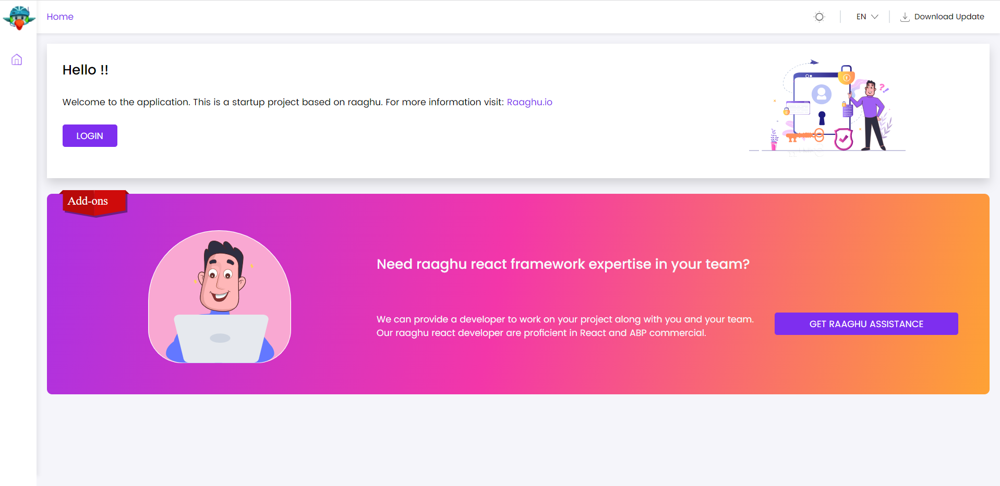
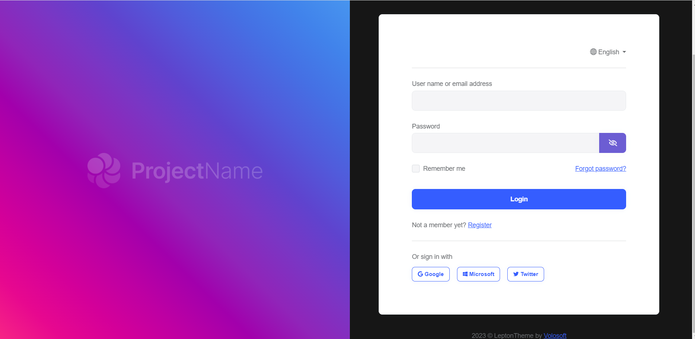

# conta
Este ⁇  implementa o Login, Registro, Forgot Password, Confirmação de e-mail, Password Reset, enviando e confirmando Two-Factor Autenticação, ⁇  de ⁇ , alternar entre as funcionalidades de um aplicativo;

Ver[a página da ⁇  do ⁇](https://commercial.abp.io/modules/Volo.Account.Pro?_ga=2.203721431.638389710.1682325508-1619359562.1681202968 "")para uma visão geral dos recursos do ⁇ .
## como instalar
A conta está pré-instalada[os modelos de inicialização.](https://docs.abp.io/en/commercial/7.2/startup-templates/application/index "")⁇ , não é preciso instalá-lo imediatamente.
### pacotes
Este ⁇  ⁇  a[guia de melhores práticas de desenvolvimento de ⁇](https://docs.abp.io/en/abp/latest/Best-Practices/Index "")e ⁇  de vários pacotes de NuGet e PM. Consulte o guia se você ⁇  ⁇  os pacotes e as ⁇  entre eles.

Você pode visitar[Página de lista de ⁇  de ⁇  de ⁇](https://abp.io/packages?moduleName=Volo.Account.Pro "")para ver a lista de pacotes relacionados com este ⁇ .
### interface de ⁇
### itens de menu
Este ⁇  não define nenhum item de menu.
### páginas
Login Page

A página de login é usada para fazer login no sistema.

### página de registo
A página de registo permite que novos usuários se registrem no seu sistema.
### interno
### ⁇
Consulte os ⁇  da classe IAccountSettingNames para todas as ⁇  ⁇  para este ⁇ .
### ⁇  de ⁇
### permissões
Consulte os AccountPermissions ⁇  de classe para todas as permissões ⁇  para este ⁇ .
