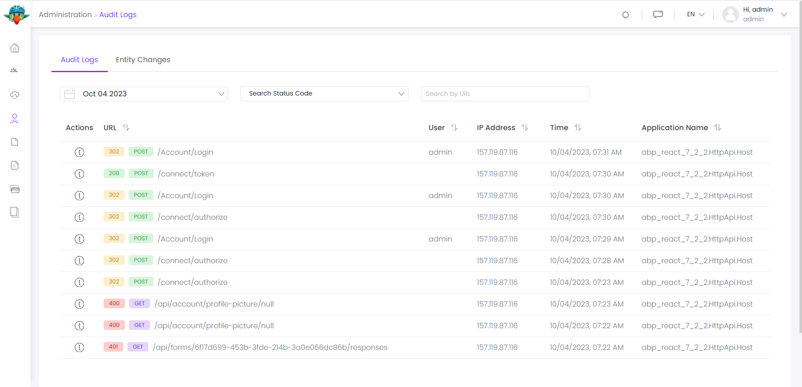

# ⁇  de registro de auditoria
Este ⁇  implementa o sistema de registro de auditoria de uma ⁇ ;

- Veja todos os logs de auditoria do sistema e os logs de auditoria do filtro facilmente.
- Exibir detalhes de log de auditoria, ações executadas e entidades alteradas.
- Veja todas as ⁇  de entidades e filtros de ⁇  de ⁇ .
- Veja os detalhes de uma mudança de ⁇ .
- Veja todas as ⁇  de uma ⁇ .
- Este ⁇  também define widgets reutilizáveis "Execução de Média Duração por Dia" e "Rata de Erro".

Ver[a página da ⁇  do ⁇](https://docs.abp.io/en/commercial/7.0/Startup-Templates/Index "")para uma visão geral dos recursos do ⁇ .
## como instalar
A identidade está pré-instalada[os modelos de inicialização.](https://docs.abp.io/en/commercial/7.0/Startup-Templates/Index "")⁇ , não é preciso instalá-lo imediatamente.
### pacotes
Este ⁇  ⁇  a[guia de melhores práticas de desenvolvimento de ⁇](https://docs.abp.io/en/abp/latest/Best-Practices/Index "")e ⁇  de vários pacotes de NuGet e PM. Consulte o guia se você ⁇  ⁇  os pacotes e as ⁇  entre eles.

Você pode visitar[Auditoria Logging ⁇  lista página](https://abp.io/packages?moduleName=Volo.AuditLogging.Ui "")para ver a lista de pacotes relacionados com este ⁇ .
### itens de menu
O ⁇  de logs de auditoria adiciona os seguintes itens ao menu "Main", sob o item de menu "Administração":

- Logs de auditoria: Listar, visualizar e filtrar logs de auditoria e ⁇  de ⁇ .

IAbpAuditLoggingMainMenuNames classe tem as constantes para os nomes dos itens de menu.
### páginas
Logs de auditoria

A aba de logs de auditoria é usada para listar, visualizar e filtrar logs de auditoria e ⁇  de ⁇  no sistema.

### ⁇  de log de auditoria
Você pode ver detalhes de um registro de auditoria clicando no ⁇  de ampliação em cada linha de log de auditoria:

- **Nota geral: Esta guia ⁇  informações detalhadas sobre o log de auditoria.**
- **Ações: Esta guia mostra a lista de ações (ações do controlador e ⁇  do método de serviço de ⁇  com seus ⁇ ) executadas durante uma ⁇  web.**
- **Alterações: Esta guia mostra entidades alteradas durante a ⁇  da web.**

<strong></strong>
