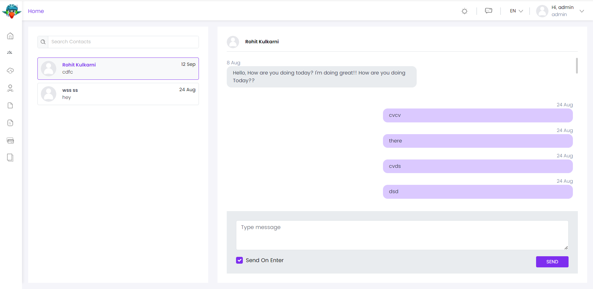

# ⁇  de bate-papo
Este ⁇  implementa mensagens em tempo real entre usuários para uma ⁇ .
## instalação
Nenhuma instalação adicional é ⁇  em termos de ⁇  do BP Suite e da Instalação Manual como ele vem junto com o modelo de inicialização
### pacotes
Este ⁇  ⁇  a[guia de melhores práticas de desenvolvimento de ⁇](https://docs.abp.io/en/abp/latest/Best-Practices/Index "")e ⁇  de vários pacotes de NuGet e PM. Consulte o guia se você ⁇  ⁇  os pacotes e as ⁇  entre eles.

Você pode visitar[Página de lista de pacotes de ⁇  de Chat](https://abp.io/packages?moduleName=Volo.Chat "")para ver a lista de pacotes relacionados com este ⁇ .
### interface de ⁇
### página de bate-papo
Esta é a página que os usuários enviam mensagens uns aos outros.

### interno
### ⁇  de ⁇
Entidades e ⁇  agregadas

- 
    
    Mensagem (raiz agregado): Representa uma mensagem de bate-papo. Implements IMultiTenant.
        
    - Texto: Conteúdo de mensagem.
        
    - IsAllRead: Mensagem ler informações.
        
    - ReadTime: Mensagem ler informações sobre o tempo.
        
    

- 
    
    ChatUser (aggregate root): Representa um ⁇  de chat.

Implements IUser e IUpdateUserData interfaces.

- 
    
    UserMessage: é criado para cada lado (sensor e receptor) de uma mensagem.
    
    Implements IMultiTenant e IAggregateRoot interfaces.
        
    - ChatMessageId: Id da Mensagem ⁇ .
        
    - UserId: Id de ChatUser.
        
    - TargetUserId: Id de outros ChatUser.
        
    - Lado: Estados que se trata de uma mensagem de envio ou mensagem recebida.
        
    - IsRead: Leia informações.
        
    - ReadTime: Leia informações sobre o tempo.
        
    

- 
    
    Conversação: é criado para cada lado de uma conversa entre os usuários. Implements IMultiTenant e IAggregateRoot interfaces.
    
    Implements IMultiTenant e IAggregateRoot interfaces.
        
    - UserId: Id de ChatUser.
        
    - TargetUserId: Id de outros relacionados ChatUser.
        
    - LastMessageSide: é o lado da última mensagem (enviar ou receber).
        
    - LastMessage: Conteúdo da última mensagem na conversa.
        
    - LastMessageDate: Data da última mensagem na conversa.
        
    - UnreadMessageCount: Contagem de mensagens ⁇ -vivos na conversa.
        
    

### repositórios
Este ⁇  ⁇  a[Melhores Práticas e Convenções Repositórios](https://docs.abp.io/en/abp/latest/Best-Practices/Repositories "")Guia .

Seguindo os repositórios personalizados são ⁇  para este ⁇ :

- IConversationRepository
- IUserMessageRepository
- IChatUserRepositório
- IMessageRepositório

### ⁇  de ⁇

- MessagingManager

### ⁇  de ⁇
### ⁇  de ⁇

- ConversaçãoAppService (implements IConversationAppService): Usado para enviar mensagens, conversar entre usuários e marcar uma conversa como ler.
- SettingsAppService (implements ISettingsAppService): Usado para salvar as ⁇  do chat.
- ContactAppService (implements IContactAppService): Usado para obter uma lista de ⁇  e ⁇  total de mensagens de ⁇ -vivos de um ⁇ .
- DistribuídoEventBusRealTimeChatMessageSender (implements IRealTimeChatMessageSender): Utilizado para publicar mensagens de bate-papo para distribuído bus de eventos.
- SignalRRealTimeChatMessageSender (implements IRealTimeChatMessageSender): Usado para enviar mensagens para o cliente de sinal de destino.

