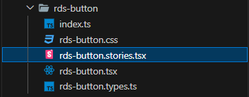
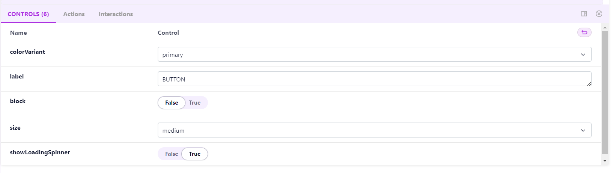
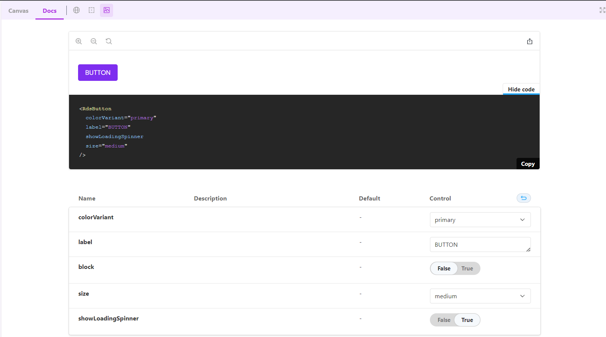

### livro de ⁇
⁇  do livro de ⁇  você pode visualizar e ⁇  em torno das características do raaghu. Snippets para os elementos ⁇  testar e projetar seu I mais rápido e eficientemente.

Você pode personalizar e estender Storybook para atender às necessidades do seu projeto. O ⁇  .storybook conterá arquivos de configuração, e você pode personalizar a ⁇  de Storybook, ⁇  addons e muito mais.

Em Storybook, os componentes são ⁇  organizados em "histórias" para mostrar seus diferentes estados, ⁇  e casos de uso. Storybook oferece uma maneira de documentar visualmente e testar seus componentes em ⁇ . Elementos de botões são um exemplo comum para a criação de ⁇  em Storybook.

⁇  o arquivo de ⁇  para elementos particulares usando o nome.stories do arquivo. stotybook ⁇  por código padrão na criação de arquivos.

    import React from 'react';
    import { Story, Meta } from '@storybook/react';
    
    import MyComponent from './MyComponent'; // Import your component
    
    export default {
      title: 'MyComponent',
      component: MyComponent,
    } as Meta;
    
    const Template: Story = (args) =&gt; <mycomponent {...args}="">;
    
    export const Default = Template.bind({});
    Default.args = {
      // Add default props here
    };
    </mycomponent>
⁇ , tome o exemplo como elemento de ⁇ . ⁇  o arquivo ⁇ .stories.

Substitua MyComponent com o nome real do seu componente. Este exemplo assume que o seu componente é ⁇  MyComponent.

Run Storybook, e você deve ver sua história de componentes em the Storybook UI.

⁇  mais ⁇  conforme necessário para outros componentes no seu projeto.

Isso mesmo! Agora você tem um Storybook configurado com React e TypeScript, e você pode ⁇ -lo para documentar e mostrar seus componentes. Certifique-se de personalizar as ⁇  do Storybook e suas

⁇  são o controle e a ação que passa embora o argTypes, aqui é o exemplo para o elemento de ⁇ .

    export default {
        title: "Elements/Button",
        component: RdsButton,
        argTypes: {
            colorVariant: {
                options: [
                    "primary",
                    "secondary",
                    "success",
                    "info",
                    "warning",
                    "danger",
                    "dark",
                    "light",
                ],
                control: { type: "select" },
            },
            size: {
                options: ["small", "medium", "large"],
                control: { type: "select" },
            },
            tooltipPlacement: {
                options: ["top", "bottom", "right", "left"],
                control: { type: "radio" },
                if: { arg: 'tooltip' }
            },
        },
    } as ComponentMeta<typeof rdsbutton="">;
    
    const Template: ComponentStory<typeof rdsbutton=""> = (args) =&gt; (
        <rdsbutton {...args}="">
    );
    </rdsbutton></typeof></typeof>
crie as ⁇  ⁇  para elementos de botões.

Estado padrão de ⁇  ⁇  abaixo

    export const Default = Template.bind({});
    Default.args = {
        colorVariant: "primary",
        label: "BUTTON",
        block: false,
        size: "medium",
        showLoadingSpinner:true,
    };

Estado ⁇  de ⁇  ⁇  abaixo

    export const Disable = Template.bind({});
    Disable.args = {
        colorVariant: "primary",
        label: "Disable",
        isDisabled: true,
        block: false,
        size: "medium",
    };

### controle
O controle permite que você ajuste e personalize as propriedades ou suportes de um componente em Storybook sem ⁇  o código fonte. Para um componente de ⁇ , você pode usar controles para alterar seu texto, cor, ⁇  e outras propriedades ⁇ . Isso é particularmente ⁇  para testar diferentes ⁇  e estados de seus componentes.

Há um ⁇  de controle no livro de ⁇  UI. Vai mostrar o controle múltiplo.

### docs
A ⁇  em Storybook é muitas vezes gerada usando addons como  ⁇ storybook/addons-docs. Ele permite que você ⁇ va a ⁇  para seus componentes diretamente dentro de seus arquivos de história usando uma combinação de Markdown e TX. Esta ⁇  pode ser obtida a partir da interface Storybook, ⁇  mais fácil para os desenvolvedores ⁇ em como usar seus componentes.

