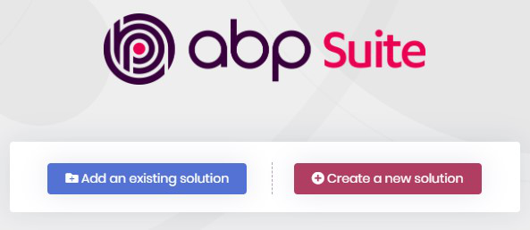
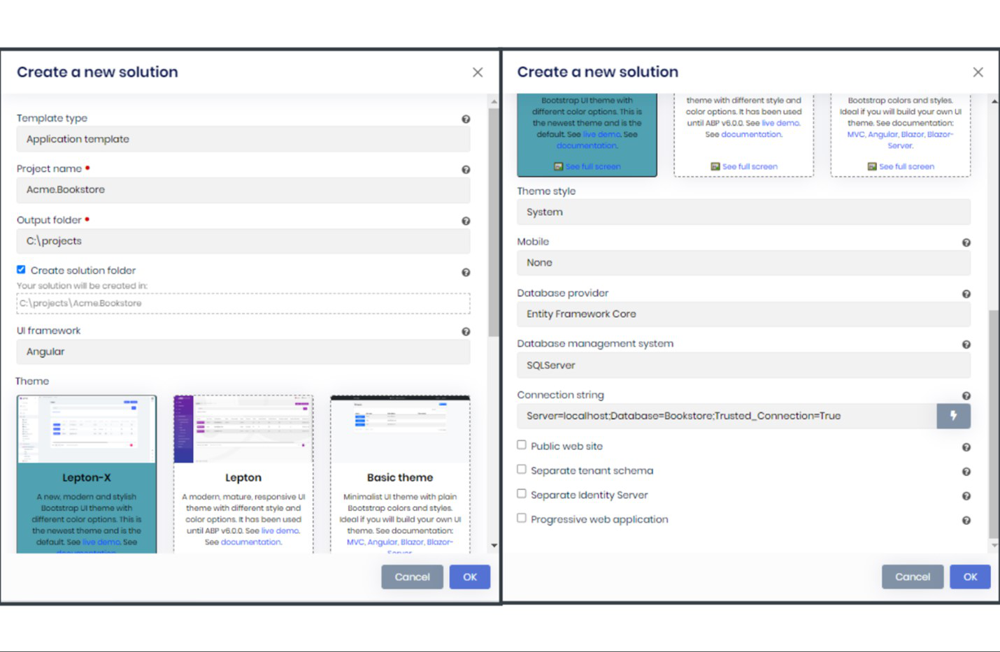

# criando uma nova ⁇
## crie um novo projeto
Há duas formas de ⁇  um novo projeto: BP Suite e BP LI
### usando amp suíte para ⁇  um novo projeto.
ABP Suite é recomendada maneira de ⁇  novas ⁇  para o BP Comercial

Execute o Suite BP com o seguinte comando:

       abp suite

- Este comando inicia a ⁇ te BP e abre no seu navegador padrão:

Clique no Criar um novo ⁇  de ⁇  e preencha o formulário modal:

⁇  o framework UI como raaghu-react, Database Provider, e outras ⁇  com base em suas ⁇ , em seguida, clique no ⁇  Of
### usando o cli amplificador para ⁇  um novo projeto
Use o novo comando do BP LI para ⁇  um novo projeto:

       abp new Acme.Bookstore -t app-pro

- -t argumento especifica o[startup templateABP Módulos comerciais](https://commercial.abp.io/modules "")Nome . app-pro é o modelo de inicialização que ⁇  o essencial pré-instalado e configurado para você.
- Podemos também usar um nível diferente de espaços de nomes; por exemplo. Livraria, Acme.Bookstore ou Came.Retail.Bookstore.

## tema
### raaghu-temas
Um novo, moderno e elegante tema raaghu com diferentes ⁇  de cores, é o tema mais novo. Você pode ⁇  uma de 3 ⁇  Escura, Luz e Semi Escuro.
### comandos &amp;amp; ⁇  de cli
[documento BP LI](https://docs.abp.io/en/abp/latest/CLI "")cobre todos os comandos e ⁇  ⁇  para o BP LI. A principal diferença para o BP Comercial é o nome do modelo. [Modelos de inicialização comercial BP](https://docs.abp.io/en/commercial/7.2/startup-templates/index "")documento para outros modelos comerciais.
### a estrutura de ⁇
A ⁇  tem uma estrutura em camadas (baseada na[Design Driven de Domínio](https://docs.abp.io/en/abp/Domain-Driven-Design "")) e ⁇  projetos de teste de unidade &amp; ⁇ . [documento de estrutura de ⁇](https://docs.abp.io/en/commercial/7.2/startup-templates/application/solution-structure "")para ⁇  a estrutura de ⁇  em detalhes.
### próximo passo

- [Executando a ⁇](Getting-Started-Running-Solution.md "")

