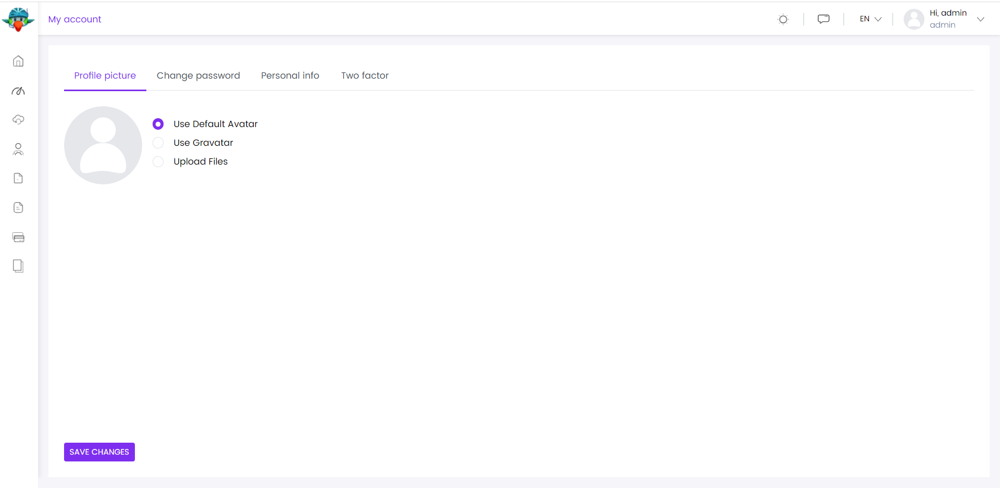

## personalização
### gerenciar abas da página do perfil
Sob a Minha Conta, clicando no drop-down do perfil de ⁇  do host, você recebe 4 tabs como Perfil Imagem, Alterar senha, Informações Pessoais e Dois ⁇

As abas na página de perfil de ⁇  podem ser geridas através do ManageProfileTabsService que é ⁇  pelo ⁇   ⁇ vol/amp.ng.account/public/config. Você pode ⁇ , remover ou editar uma aba com este serviço.

