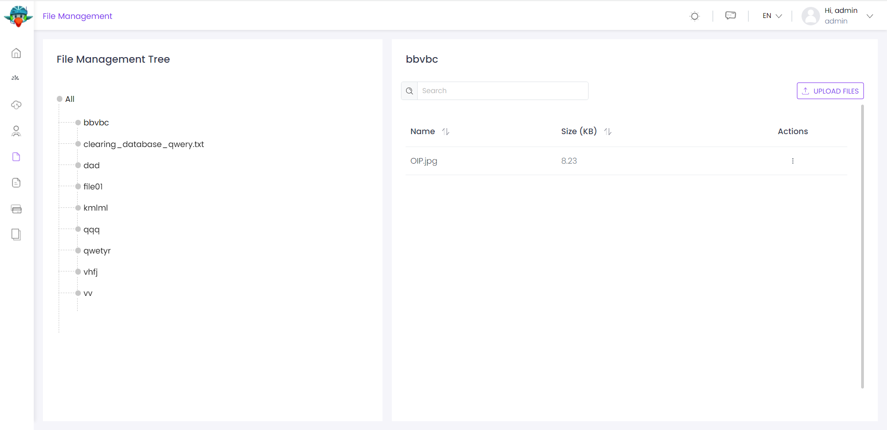
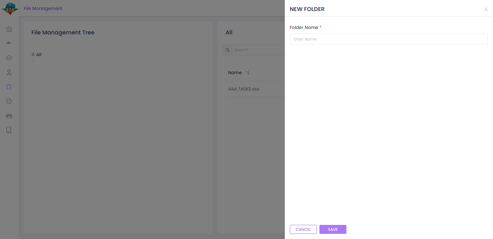
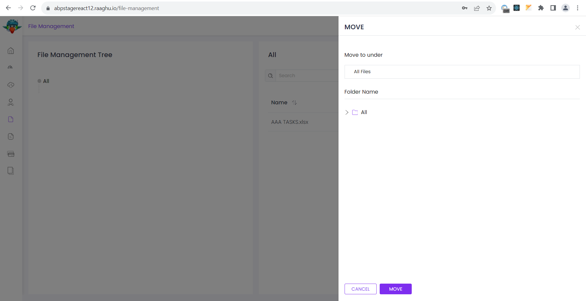
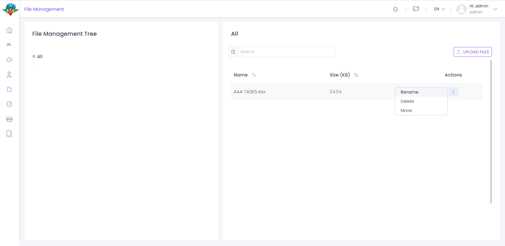
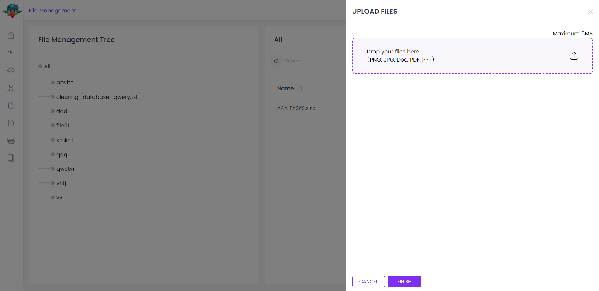
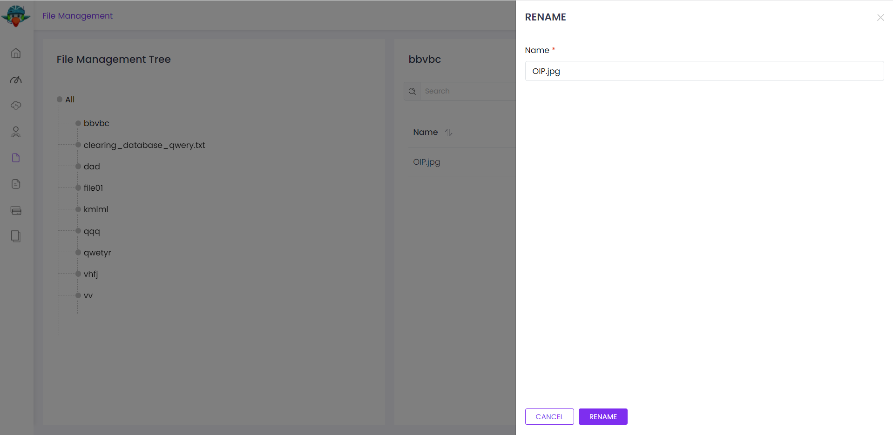

# ⁇  de ⁇  de arquivos
Este ⁇  é usado para carregar, baixar e ⁇  arquivos em uma estrutura de pasta hierárquica. ⁇  é ⁇  com multi-tenância e você pode ⁇  o limite total de ⁇  para seus inquilinos.

Este ⁇  é baseado no[LB Scoring](https://docs.abp.io/en/abp/latest/Blob-Storing "")sistema, assim ele pode usar diferentes provedores de armazenamento para ⁇  o conteúdo do arquivo.

Ver[a página da ⁇  do ⁇](https://commercial.abp.io/modules/Volo.FileManagement "")para uma visão geral dos recursos do ⁇ .
## reage-ui
O ⁇  de Gerenciamento de Arquivos é baseado no[LB Scoring](https://docs.abp.io/en/abp/latest/Blob-Storing "")sistema como ⁇  antes, e ele usa o FileManagementContainer como um recipiente LB.
## ⁇  de blob provedor
O ⁇  de Gerenciamento de Arquivos é baseado no[LB Scoring](https://docs.abp.io/en/abp/latest/Blob-Storing "")sistema como ⁇  antes, e ele usa o FileManagementContainer como um recipiente LB.

Você deve definir um provedor LB para o FileManagementContainer.

      Configure(options =&gt;
                {
                    options.Containers.Configure(c =&gt;
                        {
                            c.UseDatabase(); // You can use FileSystem or Azure providers also.
                        });
                    });

Por favor, ⁇[LB Storage Fornece ⁇](https://docs.abp.io/en/abp/latest/Blob-Storing#blob-storage-providers "")para mais informações sobre os provedores e como utilizá-los.
### pacotes
Este ⁇  ⁇  a[guia de melhores práticas de desenvolvimento de ⁇](https://docs.abp.io/en/abp/latest/Best-Practices/Index "")e ⁇  de vários pacotes NuGet e PM. Consulte o guia se você ⁇  ⁇  os pacotes e as ⁇  entre eles.

Você pode visitar[Lista de pacotes de ⁇  de gestão de arquivos](https://abp.io/packages?moduleName=Volo.FileManagement "")página para ver a lista de pacotes relacionados com este ⁇ .
### interface de ⁇
### itens de menu
O ⁇  de Gerenciamento de Arquivos adiciona os seguintes itens ao menu "Main", sob o item de menu "Administração":

- **Gerenciamento de arquivos: Listar, ver toda a estrutura de pastas e arquivos.**

FileManagementMenuNames classe tem as constantes para os nomes dos itens do menu.
### páginas
Gestão de Arquivos

A página de Gestão de Arquivos é usada para ⁇  pastas, carregar arquivos e visualizar a lista de pastas e arquivos que ⁇ am na ⁇ .

### pastas
Você pode ⁇  uma nova pasta clicando em Criar ⁇  de pasta que está ⁇  no topo da página. A pasta será ⁇  no ⁇  ⁇ .

Você pode mover uma pasta para outro ⁇  na vista da ⁇  esquerda.

Você pode renomear uma pasta clicando em Ações - ⁇  Renomear na ⁇ .

### arquivos
Você pode carregar arquivos clicando em Adicionar arquivos ⁇  que ⁇  no topo da página. Isto irá abrir um novo modal para ⁇  seus arquivos locais para carregar. Os arquivos serão carregados no ⁇  ⁇ .

Você pode mover arquivos clicando em Ações - ⁇  Mover na ⁇  de dados.

Você pode renomear um arquivo clicando em Ações - ⁇  Renomear na ⁇  de dados.

### ⁇  de dados
Este ⁇  não semeia dados.
### interno
#### ⁇  de ⁇
Aggregados

Este ⁇  ⁇  a[Entidade Melhores Práticas e Convenções](https://docs.abp.io/en/abp/latest/Best-Practices/Entities "")Guia .
#### texttemplatecontent

- DirectoryDescriptor (raiz agregada): Representa uma pasta.
- FileDescriptor (aggregate root): Representa um arquivo.

Repositórios

Este ⁇  ⁇  a[Melhores Práticas e Convenções Repositórios](https://docs.abp.io/en/abp/latest/Best-Practices/Repositories "")Guia .

Seguindo os repositórios personalizados são ⁇  para este ⁇ :

- Descrição do IDRepositório
- IFileDescriptorRepositório

Serviços de Domínio

Este ⁇  ⁇  a[Serviços de Domínio Melhores Práticas e Convenções](https://docs.abp.io/en/abp/latest/Best-Practices/Domain-Services "")Guia .
#### ⁇  de diretórios
DirectoryManager é usado para gerenciar suas pastas como ⁇ , renomear, mover e ⁇ .
#### filemanager
DirectoryManager é usado para gerenciar suas pastas como ⁇ , renomear, mover e ⁇ .
#### ⁇
Este ⁇  não define qualquer configuração.
#### recursos
Você pode ativar ou ⁇ ar este ⁇  para cada inquilino, também você pode definir o ⁇  de armazenamento máximo para cada inquilino. Consulte os ⁇  da classe FileManagementCaracterísticas para todas as funcionalidades ⁇  para este ⁇ .
#### ⁇  de ⁇
Serviços de ⁇

- DirectoryDescriptorAppService (implements IDirectoryDescriptorAppService): implementa os casos de uso da gerência de arquivos I.
- Descrição do arquivoAppServiceDescriptorAppService (implements IFileDescriptorAppService): Implica os casos de uso da gerência de arquivos I.

#### provedores de banco de dados
Comum
#### prefixo de ⁇ /coleção &amp; esquema
Todas as ⁇ /coleções usam o prefixo Fm por padrão. Definir propriedades ⁇ icas na classe FileManagementDbProperties se você precisa ⁇  o prefixo de ⁇  ou definir um nome de esquema (se suportado pelo seu provedor de banco de dados).
#### string de ⁇
Este ⁇  usa FileManagement para o nome da string de ⁇ . Se você não definir uma string de ⁇  com este nome, ele se encaixa para a ⁇  de Default ⁇ .

[⁇  de ⁇](https://docs.abp.io/en/abp/latest/Connection-Strings "")⁇  para detalhes.

Entity Framework Core
#### mesas

- **FmDirectoryDescrição**
- **FmFileDescriptors**

MongoDB
#### coleções

- **FmDirectoryDescrição**
- **FmFileDescriptors**

MongoDB
#### permissões
Consulte os ⁇  da classe FileManagementPermissions para todas as permissões ⁇  para este ⁇ .
