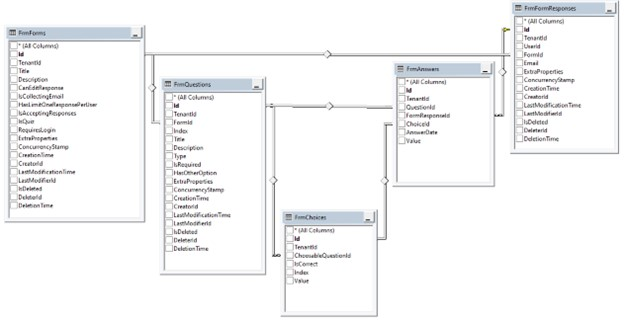

# 
Este ⁇  permite que você crie questionário para coletar informações. O ⁇  de ⁇  pode ⁇  ⁇  como eles entram e você pode exportar os dados para um arquivo CSV. Você pode compartilhar sua forma com os outros com seu link único formulário. Você pode solicitar a autenticação ou ⁇  a resposta anônima. É ⁇  ao aplicativo Google Form. A área de uso é ⁇  ampla, você pode ⁇  ⁇ , gerenciar ⁇  de eventos, coletar campanhas de e-mail para um ⁇  informativo, ⁇  um questionário, e até receber um pedido.

Ver[a página da ⁇  do ⁇](https://commercial.abp.io/modules/Volo.Forms "")para uma visão geral dos recursos do ⁇ .

I SCREENSHOTOS A ADD
## interno
### ⁇  de ⁇
Aggregados

Este ⁇  ⁇  a[Entidade Melhores Práticas e Convenções](https://docs.abp.io/en/abp/latest/Best-Practices/Entities "")Guia .

- 
    **Formulário**
        
    - A principal raiz agregada das entidades do formulário. As ⁇  de formulário, título e ⁇  estão sendo ⁇ adas nesta ⁇ .
        
    

- 
    **QuestionBase**
        
    - Ele guarda questões do formulário. Esta ⁇  é dependente da forma de ⁇  por FormId.
        
    

- 
    **FormResponse**
        
    - Cada formulário submetido é um novo registro de resposta de formulário. A resposta do formulário tem ⁇  de resposta.
        
    

Repositórios

Este ⁇  ⁇  a[Melhores Práticas e Convenções Repositórios](https://docs.abp.io/en/abp/latest/Best-Practices/Repositories "")Guia .

Seguindo os repositórios personalizados são ⁇  para este ⁇ :

- IFormRepositório
- IQuestionRepository
- IChoiceRepositório
- IResponseRepositório

Serviços de ⁇

Este ⁇  ⁇  a[Serviços de Domínio Melhores Práticas e Convenções](https://docs.abp.io/en/abp/latest/Best-Practices/Domain-Services "")Guia .
### questionador
QuestionManager é usado para ⁇  as questões do seu formulário.
### ⁇  de ⁇
Serviços de ⁇

- FormApplicationService
- QuestionAppService
- RespostaAppService

### provedores de banco de dados
Comum
### ⁇  / prefixo de coleção &amp; esquema
Todas as ⁇ /coleções usam o prefixo From por padrão. Definir propriedades ⁇ icas na classe FormsDbProperties se você precisa alterar o prefixo da ⁇  ou definir um nome de esquema (se suportado pelo seu provedor de banco de dados).
### string de ⁇
Este ⁇  usa Forms para o nome da string de ⁇ . Se você não definir uma string de ⁇  com este nome, ele se encaixa para o Default string de ⁇ .

[⁇  de ⁇](https://docs.abp.io/en/abp/latest/Connection-Strings "")⁇  para detalhes.

Centro-Quadro de Entidade / MongoDB

Tabelas / Coleções

- **FrmForms: Lista de ⁇ .**
- **FrmQuestions: Questões dos ⁇**
- **FrmAnswers: Respostas da resposta do formulário.**
- **FrmChoices: Escolha de ⁇ .**
- **FrmFormResponses: Uma nova resposta de formulário está sendo ⁇  cada vez que o ⁇  submete o formulário.**

**Relacionamentos de Entidade**

### permissões
Consulte os FormsPermissions ⁇  de classe para todas as permissões ⁇  para este ⁇ .
