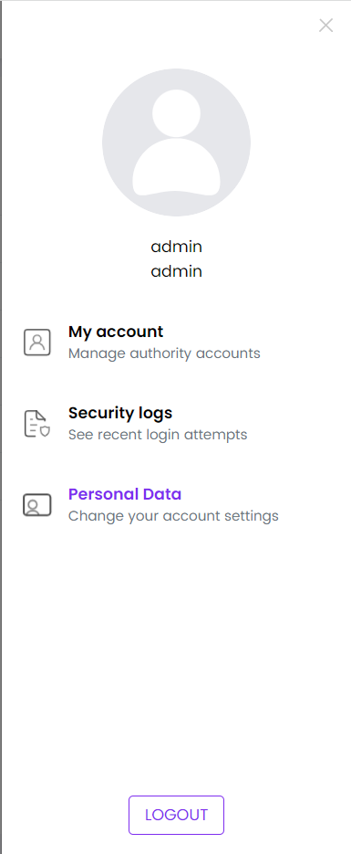
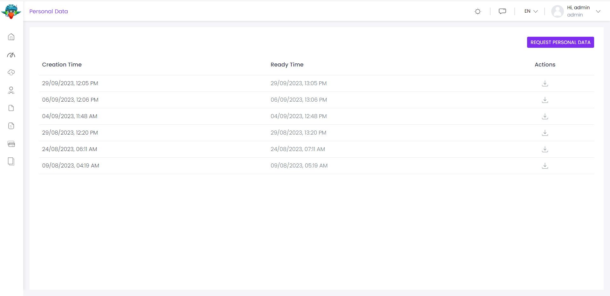

# gdpr module
Este ⁇  permite que os usuários baixem e excluam seus dados ⁇  coletados pela ⁇ .
## como instalar
O ⁇  do PIB é pré-instalado nos modelos de ⁇  e ⁇  (camada de ⁇ ). ⁇ , não é preciso instalá-lo imediatamente.

Se você precisa instalá-lo ⁇ , há 2 ⁇  de instalá-lo:

Via BP LI: Abra um terminal de linha de comando na pasta de ⁇  (na pasta onde o arquivo *.son está ⁇ ) e digite o seguinte comando: Amp add-module Volo.Gdpr Bash Via BP Suite: Run ABP Suite, ⁇
## interface de ⁇
### itens de menu
O ⁇  do PIB adiciona o seguinte item ao menu de perfil "User".

Dados Pessoais: Página de Gestão de Dados Pessoais. Você pode solicitar seus dados ⁇ , listar todos os pedidos de dados ⁇ , baixar e/ou ⁇  dados ⁇ , e ⁇  a conta ⁇ .

### páginas
### dados ⁇
A página "Dados Pessoais" é usada para gerenciar pedidos de dados ⁇ . Você pode ver os pedidos passados, status atual do último pedido, ⁇  um novo pedido, baixar dados ou ⁇  todos os seus dados ⁇  e conta do aplicativo.

