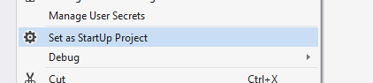
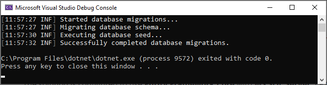
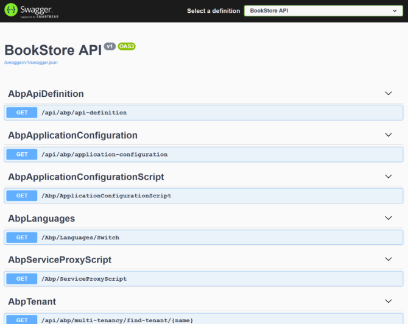

# ⁇  o banco de dados
### string de ⁇
⁇  a string de ⁇  no arquivo appsettings.son sob o projeto .Web .
```json
    "ConnectionStrings": {"Default": "Server=localhost;Database=BookStore;Trusted_Connection=True"}
```
**Sobre as ⁇  de ⁇  e sistemas de gestão de banco de dados**

A ⁇  é configurada para usar Entity Framework Core com M SQL Server por padrão. No entanto, se você tiver ⁇ ado outro MS usando o ⁇  -dms no novo comando BP LI (como -dms SQL), a string de ⁇  pode ser diferente para você.

En Core ⁇[vários](https://learn.microsoft.com/en-us/ef/core/providers/ "")provedores de banco de dados e você pode usar qualquer MS suportado. Ver[o documento de ⁇  do ⁇  de Entidade](https://docs.abp.io/en/abp/latest/Entity-Framework-Core "")aprender a aprender[alternar para outro MS](https://docs.abp.io/en/abp/latest/Entity-Framework-Core-Other-DBMS "")Se ⁇  mais tarde.
### origens de carros
⁇  o CorsOrigins no arquivo appsettings.son sob o .Web projeto.
```json
     "CorsOrigins": "https://*.abp_react_7_3.com,http://localhost:4200,http://localhost:8080",
```
A configuração CorsOrigins define as origens permitidas para Cross-Origin Compartilhamento de Recursos (COR). Esta configuração permite pedidos das origens ⁇ . Nesta configuração, '[http://localhost: 8080](http://localhost:8080 "")' está ⁇  para ⁇  pedidos de um servidor de desenvolvimento local, tipicamente usado para desenvolvimento e testes propósitos.
### migrações de banco de dados
A ⁇  utiliza o[Entity Framework Core Código Primeira Migração.](https://learn.microsoft.com/en-us/ef/core/managing-schemas/migrations/?tabs=dotnet-core-cli "")Ele vem com uma ⁇  de console .DbMigrator que ⁇  as migrações e também semeia os dados iniciais. É ⁇  no desenvolvimento, bem como no ambiente de produção.

**.DbMigrator projeto tem seus ⁇  aplicativosettings.son. ⁇ , se você ⁇  a corda de ⁇  acima, você também deve ⁇  este.**
### a ⁇  inicial
.DbMigrator ⁇  ⁇  ⁇  a ⁇  inicial em primeira ⁇ .

**Se você estiver usando Visual Studio, você pode pular para a ⁇  Running DbMigrator . No entanto, outro é (por exemplo. Rider) pode ter problemas para a primeira corrida desde que adiciona a ⁇  inicial e compila o projeto. Neste caso, abra um terminal de linha de comando na pasta da**`.DbMigrator`projetar e ⁇  o seguinte comando:
```bash
    dotnet run
```
Pela próxima vez, pode ⁇ -lo na sua DE, como normalmente faz.
### executando o dbmigrator
Clique direito para o`.DbMigrator`projeto e ⁇  Definir como StartUp Projeto



Hit F5 (ou Ctrl+F5) para ⁇  a ⁇ . Ele ⁇  uma ⁇  como ⁇  abaixo:



Inicial[dados de ⁇](Data-Seeding.md "")`admin`⁇  no banco de dados (com a senha é`1q2w3E*`) que é então usado para iniciar sessão na ⁇ . Por isso, tens de usar`.DbMigrator`Pelo menos uma vez para uma nova base de dados.

A ⁇  é configurada para usar MongoDB em seu computador local, então você precisa ter uma ⁇  de servidor MongoDB a funcionar ou ⁇  a string de ⁇  para outro servidor MongoDB.
## execute a ⁇
Aviso: Quando você cria uma ⁇  BP, os pacotes do lado do cliente estão sendo processados pela BP LI e Suite. Mas se você buscar o código-fonte que é ⁇  por outro ⁇  da equipe, sua pasta libs estará vazia. Antes de iniciar a ⁇ , execute o comando Amp install-libs em seu ⁇  Web para ⁇  as bibliotecas do lado do cliente. Isto irá povoar a pasta libs. Certifique-se de que o projeto .Web é o projeto de inicialização. Execute o aplicativo que abrirá a página de login no seu navegador:

Use Ctrl+F5 no Visual Studio (em vez de F5) para ⁇  a ⁇  sem depuração. Se não tiver um propósito de depuração, isto será mais rápido.



O aplicativo está ⁇  e ⁇ . Você pode ⁇  a ⁇  sua ⁇  com base neste modelo de inicialização.
## ver também

- [Tutorial de desenvolvimento de aplicações web](Tutorials/Creating-The-Server-Side.md "")

