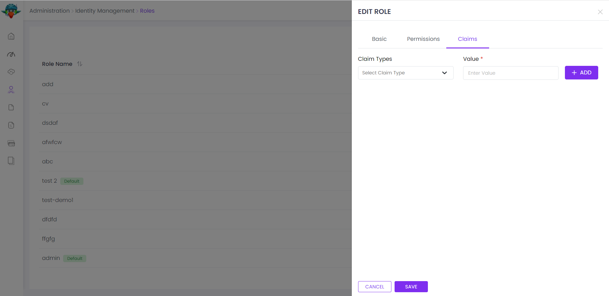

# ⁇  de ⁇  de identidade
Este ⁇  implementa o sistema de ⁇  e ⁇  de uma ⁇ ;

- Gerencie ⁇  e usuários no sistema. Um ⁇  é ⁇  ter vários ⁇ .
- Definir permissões no papel e nos níveis de ⁇ .
- Ativar/desactivar a autenticação de dois fatores e o ⁇  de ⁇  por ⁇ .
- Gerencie o perfil ⁇  do ⁇  e a senha.
- Gerenciar tipos de reivindicações no sistema, definir reivindicações para ⁇  e usuários.
- Configuração da página para gerenciar ⁇  de senha, login do ⁇ , conta e ⁇ .
- Apoia a autenticação DAP.
- Fornece verificação de número de e-mail e telefone.
- Apoia a ⁇  de login social ( Microsoft, Google, Twitter.)
- Gerencie unidades de ⁇  no sistema.
- Veja os logs de segurança (login, logotipo, ⁇  a senha...) no sistema.

Consulte a página de ⁇  do ⁇  para uma visão geral dos recursos do ⁇ .
## pacotes
Este ⁇  ⁇  a[guia de melhores práticas de desenvolvimento de ⁇](https://docs.abp.io/en/abp/latest/Best-Practices/Index "")e ⁇  de vários pacotes NuGet e PM. Consulte o guia se você ⁇  ⁇  os pacotes e as ⁇  entre eles.

Você pode visitar[Página de lista de ⁇  de ⁇  de identidade](https://abp.io/packages?moduleName=Volo.Identity.Pro "")para ver a lista de pacotes relacionados com este ⁇ .
### itens de menu
O ⁇  de identidade adiciona os seguintes itens ao menu "Main", sob o item de menu "Administração":

- **Roles: página de gestão de ⁇ .**
- **Usuários: Página de ⁇  do ⁇ .**
- **Tipos de Claim: Página de gestão do tipo de reclamação.**
- **Unidades de ⁇ : Página de gestão da unidade de ⁇ .**
- **Logs de segurança: Página de busca de log de segurança.**

A classe IdentityMenuNames tem as constantes para os nomes dos itens do menu.
### páginas
Gestão de ⁇

A página de ⁇  é usada para gerenciar ⁇  no sistema. Um papel é um conjunto de permissões atribuídas aos usuários.

Você pode ⁇  um novo papel ou editar um papel nesta página:

- **Funções padrão são atribuídas a novos usuários por padrão.**
- **As ⁇  públicas são ⁇  para outros usuários.**

### permissões de papel
Você pode gerenciar permissões de um papel:
### ui ser adicionada

- Uma ⁇  é uma ação da ⁇  ⁇  a ⁇  e usuários.
- Um ⁇  com um papel herdará todas as permissões ⁇  para o papel.
- ⁇  ⁇  pode[definem permissões](https://docs.abp.io/en/abp/latest/Authorization#permission-system ""). Uma vez que você definir um novo ⁇ , ele estará disponível nesta página.
- O lado ⁇  é a lista de ⁇ . Uma vez que você clica em um nome do ⁇ , você pode ⁇ /verificar permissões relacionadas a esse ⁇ .

### ⁇  de ⁇
Você pode definir valores de reivindicação personalizados para um papel:

Os tipos de reclamação são recuperados da lista de reclamações ⁇  na página de Gestão de Tipos de Claim (ver abaixo).
### gestão do ⁇
A página de usuários é usada para gerenciar os usuários em seu sistema.

Você pode ⁇  um novo ⁇  ou editar um ⁇  existente nesta página:

- Um ⁇  pode ter zero ou mais ⁇  no sistema.
- Você pode definir duas ⁇  de verificação de ⁇  e ⁇  de ⁇  por ⁇ .

### permissões de ⁇
Um ⁇  tem a ⁇  das permissões dos ⁇  atribuídos. O ⁇  de identidade também permite conceder permissões extras a um ⁇  específico.

- Uma ⁇  é uma ação da ⁇  ⁇  a ⁇  e usuários.
- Um ⁇  com um papel herdará todas as permissões ⁇  para o papel.
- ⁇  ⁇  pode[definem permissões](https://docs.abp.io/en/abp/latest/Authorization#permission-system ""). Uma vez que você definir um novo ⁇ , ele estará disponível nesta página.
- O lado ⁇  é a lista de ⁇ . Uma vez que você clica em um nome do ⁇ , você pode ⁇ /verificar permissões relacionadas a esse ⁇ .

### gestão do tipo de reivindicação
O ⁇  de identidade permite definir tipos de reivindicação personalizados.

- As reivindicações personalizadas podem ser usadas para ⁇  informações adicionais a um ⁇  ou papel.
- Os valores de reclamação personalizados podem então ser especificados no código de ⁇  para um ⁇  autenticado.
- Os tipos de ⁇  também são usados pelo ⁇  OpenIddict se você estiver usando-o.

### unidades de ⁇
A página de unidades de ⁇  é usada para gerenciar unidades de ⁇ , ⁇  de unidades de ⁇  e ⁇  de unidades de ⁇ .

Você pode ⁇  uma nova unidade de ⁇  ou editar uma unidade de ⁇  existente nesta página. Para ⁇  uma nova unidade de ⁇  root, clique em "Nova unidade de raiz" e preencha o formulário de ⁇ .

Para ⁇  uma subunidade a uma unidade de ⁇  existente, clique com o ⁇  direito em uma unidade de ⁇  existente e clique em "Adicionar subunidade" item de menu de contexto. Da mesma forma, para editar uma unidade de ⁇ , clique com o ⁇  direito em uma unidade de ⁇  existente e clique em "Editar" item de menu de contexto.

Você pode gerenciar ⁇  de uma unidade de ⁇  usando a guia de ⁇  por seleção de uma unidade de ⁇
### logs de segurança
A página de logs de segurança é usada para pesquisar e visualizar as ⁇  relacionadas à autenticação (login, logotipo, ⁇  a senha...) no sistema.

