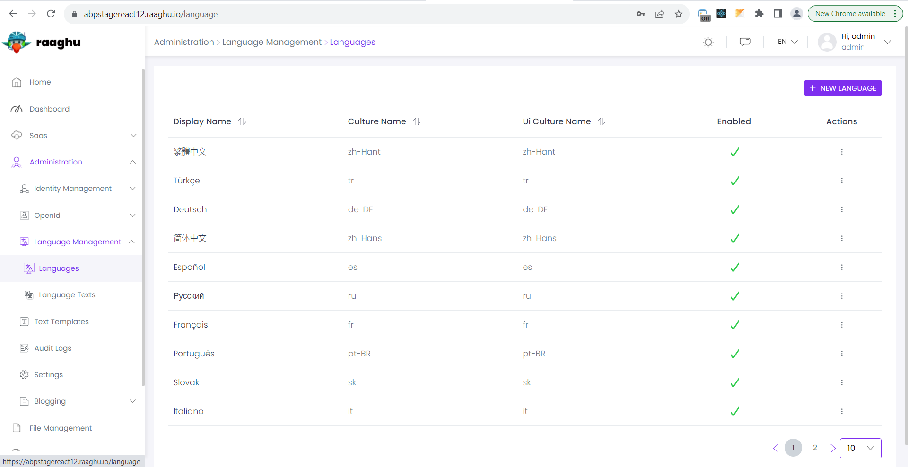
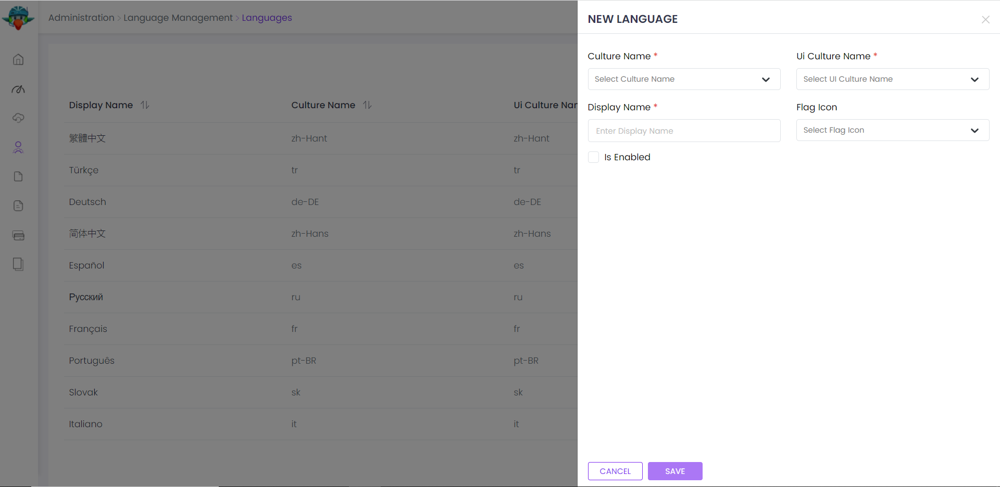
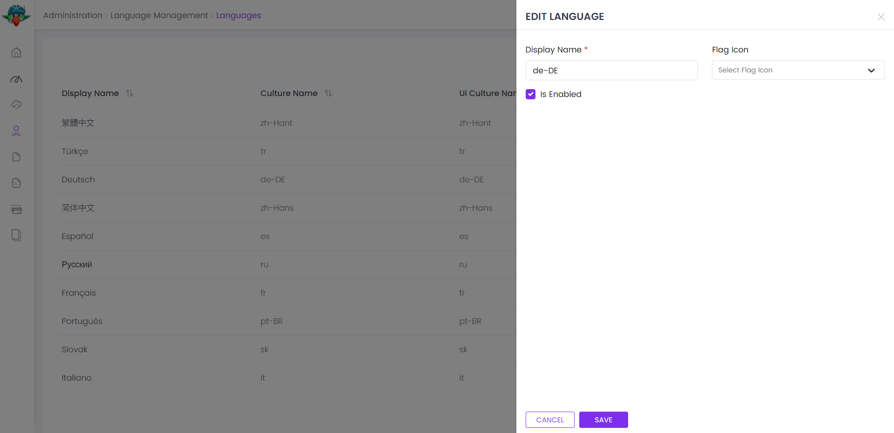
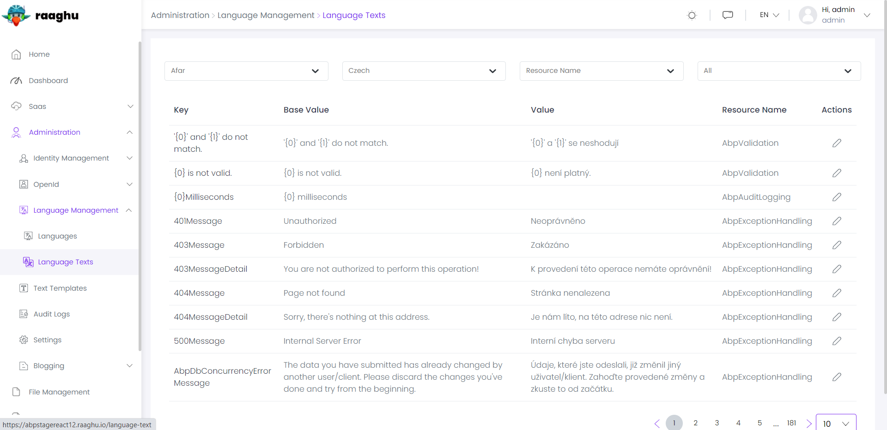
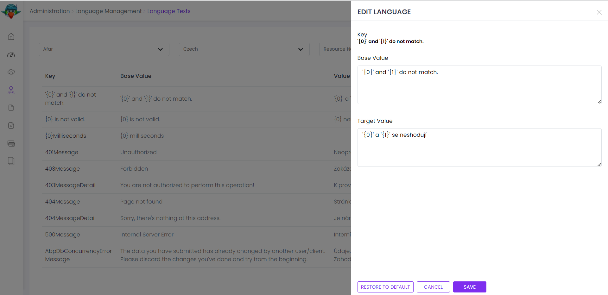

# ⁇  de gestão de idiomas
Este ⁇  implementa o sistema de gestão da linguagem de uma ⁇ ;

- Gerenciar línguas no sistema.
- Traduzir textos no UI.
- Idiomas ⁇ áveis/disponíveis.
- ⁇  o idioma padrão no UI.

Ver[a página da ⁇  do ⁇](https://commercial.abp.io/modules/Volo.LanguageManagement "")para uma visão geral dos recursos do ⁇ .
## interface de ⁇
### itens de menu
O ⁇  de gestão de idiomas adiciona os seguintes itens ao menu "Main", sob o item de menu "Administração":

- **Idiomas: Página de gestão de idiomas.**
- **Texto de Idioma: Página de ⁇  de texto de linguagem.**

LanguageManagementMenuNames classe tem as constantes para os nomes dos itens do menu.
### páginas
Idiomas

A página de idiomas é usada para gerenciar línguas no sistema.

Você pode ⁇  uma nova língua ou editar uma língua existente nesta página:

 

- **As línguas habilitadas podem ser ⁇ adas como a linguagem do sistema.**

### textos de línguas
A página de textos linguísticos é usada para gerenciar textos em diferentes línguas.

Você pode traduzir um texto para um idioma ou editar a tradução já existente nesta página.

