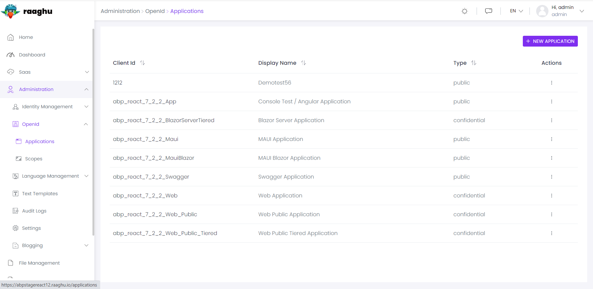
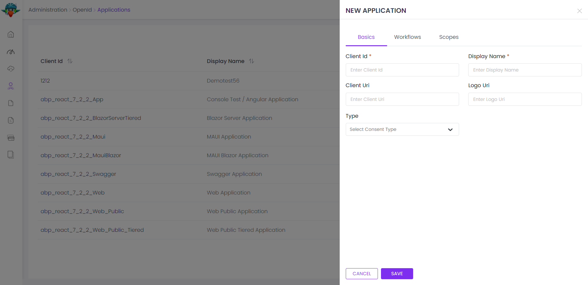
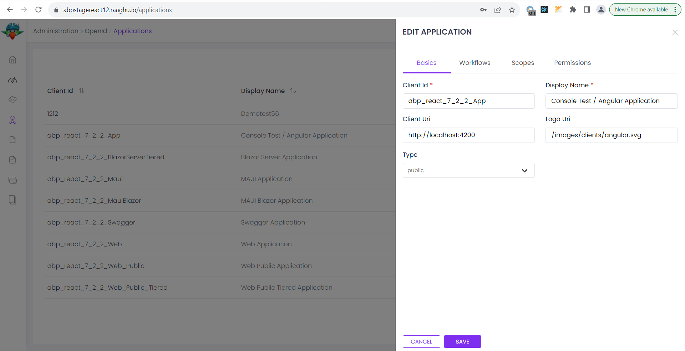
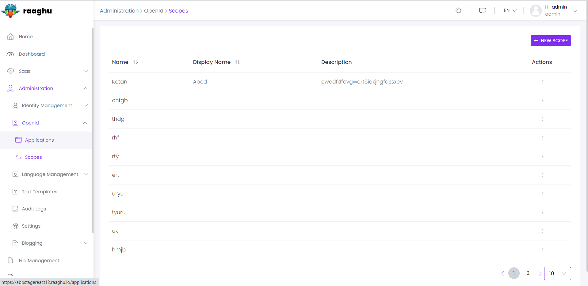
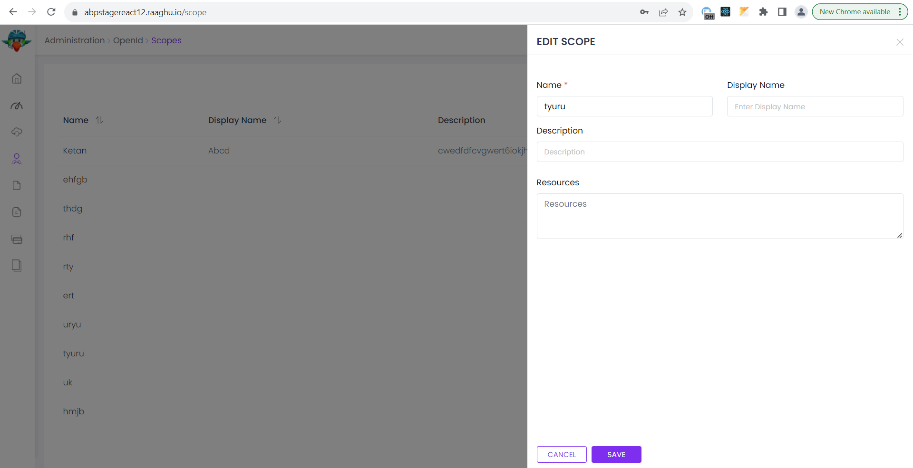

# ⁇  aberto
Este ⁇  oferece ⁇  de ⁇  e gestão para a biblioteca OpenIddict;

- Construído sobre[OpenIddict-core](https://github.com/openiddict/openiddict-core "")biblioteca.
- Gerencie a ⁇  e API escalas no sistema.
- Definir permissões para clientes.

Ver[a página da ⁇  do ⁇](https://commercial.abp.io/modules/Volo.OpenIddict "")para uma visão geral dos recursos do ⁇ .
## interface de ⁇
### itens de menu
O ⁇  OpenIddict adiciona os seguintes itens ao menu "Main", sob o item de menu "Administração":

- **Aplicações: Página de gestão de aplicativos.**
- **Scopes: Página de gestão de ⁇ .**

A classe OpenIddictProMenus tem as constantes para os nomes dos itens do menu.
## páginas
Gestão de Aplicações

A página de aplicações é usada para gerenciar OpenIddict aplicações. Um aplicativo representa aplicativos hospedados que podem solicitar tokens de seu servidor de autenticação.

Você pode ⁇  uma nova ⁇  ou editar aplicativos ⁇  nesta página:

 

API Gestão de Escopos

O ⁇  OpenIddict permite gerenciar API escopo. Para ⁇  que os aplicativos solicitem tokens de acesso para APIs, você precisa definir API escalas.

Você pode ⁇  um novo recurso API ou editar um recurso API existente nesta página:

