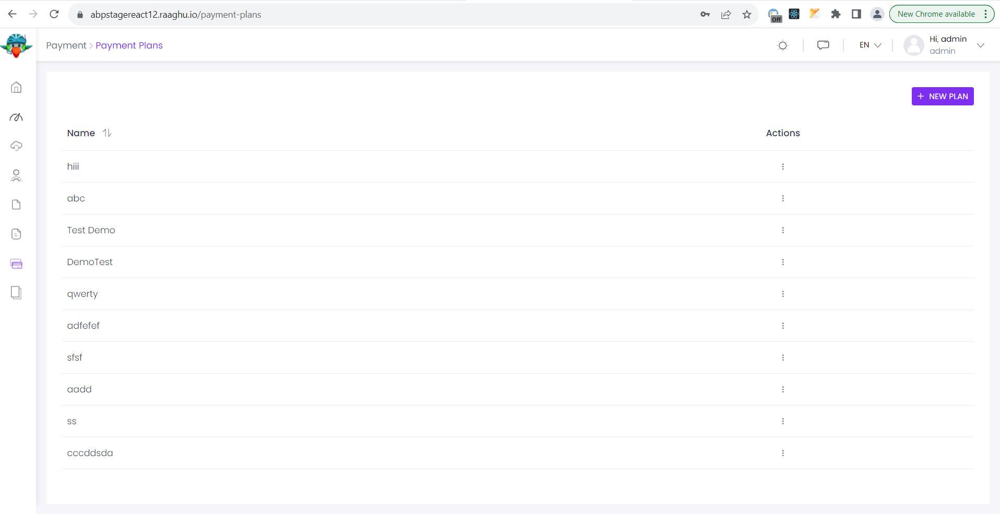
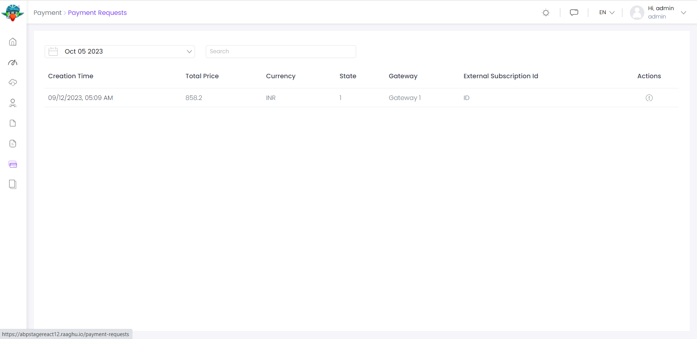

# ⁇  de pagamento
Módulo de pagamento implementa ⁇  de gateway de pagamento de uma ⁇ . Ele ⁇  um pagamento de tempo e ⁇  de pagamento recorrentes.

- Apoios[Stripe](https://stripe.com/en-in ""), [PayPal](https://www.paypal.com/in/home ""), [2Checkout](https://www.2checkout.com/ ""), [PayU](https://corporate.payu.com/ ""), [Iyzico](https://www.iyzico.com/en "")[Alias](https://global.alipay.com/platform/site/ihome "")gateways de pagamento.

Ver[a página da ⁇  do ⁇](https://commercial.abp.io/modules/Volo.Payment "")para uma visão geral dos recursos do ⁇ .
## pacotes de gateway suportados
Para usar um Gateway de Pagamento, você precisa ⁇  NuGet pacotes relacionados ao seu projeto, conforme explicado na ⁇  de Instalação Manual acima e ⁇  DependsOn ao seu ⁇  relacionado. Por exemplo, se você não quer usar PayU, você não precisa usar seus NuGet pacotes.

Depois de ⁇  pacotes de um gateway de pagamento para sua ⁇ , você também precisa ⁇  ⁇  de ⁇  de pagamento ⁇  e ⁇  para os ⁇  de pagamento que você adicionou. Veja a ⁇  Opções abaixo.
### criando um gateway de pagamento personalizado
Se você ⁇  um gateway de pagamento diferente do existente, você pode ⁇  um gateway de pagamento personalizado por seu ⁇ . 2 ⁇  são ⁇  para ⁇  um gateway de pagamento personalizado. Primeiro é ⁇  um objeto gateway de pagamento que implementa IPaymentGateway. Esta interface exp ⁇  as ⁇  de pagamento do núcleo sem qualquer UI. Segundo passo é ⁇  I para o gateway de pagamento. Isto eu é usado para redirecionar o ⁇  para o gateway de pagamento e validar o pagamento.

Seguir[instruções aqui](https://docs.abp.io/en/commercial/7.0/modules/payment-custom-gateway "")para ⁇  um gateway de pagamento personalizado.
### pacotes
Este ⁇  ⁇  a[guia de melhores práticas de desenvolvimento de ⁇](https://docs.abp.io/en/abp/latest/Best-Practices/Index "")e ⁇  de vários pacotes de NuGet e PM. Consulte o guia se você ⁇  ⁇  os pacotes e as ⁇  entre eles.

Você pode visitar[Página de lista de ⁇  de ⁇  de pagamento](https://abp.io/packages?moduleName=Volo.Payment "")para ver a lista de pacotes relacionados com este ⁇
### interface de ⁇
#### páginas públicas
Selecção de gateway de pagamento

Esta página permite ⁇  um gateway de pagamento. Se ⁇  um gateway de pagamento configurado para a ⁇  final, esta página será saltada.
#### 
Esta página é usada para enviar nome, sobrenome e endereço de e-mail do ⁇  para pagar.
#### páginas de admin
Página de planos de pagamento

Os planos de pagamento para as assinaturas podem ser geridos nesta página. Você pode ⁇  as assinaturas ⁇  para cada gateway a um plano.

Página de Pedido de Pagamento

Esta página lista todas as ⁇  de pedido de pagamento na ⁇ .

