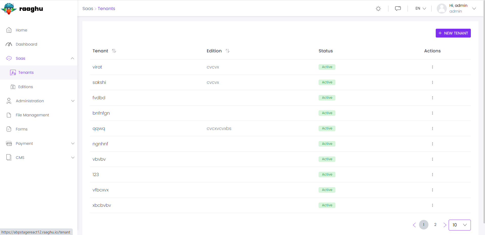
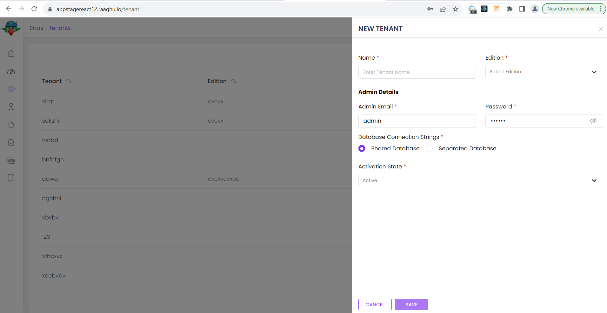
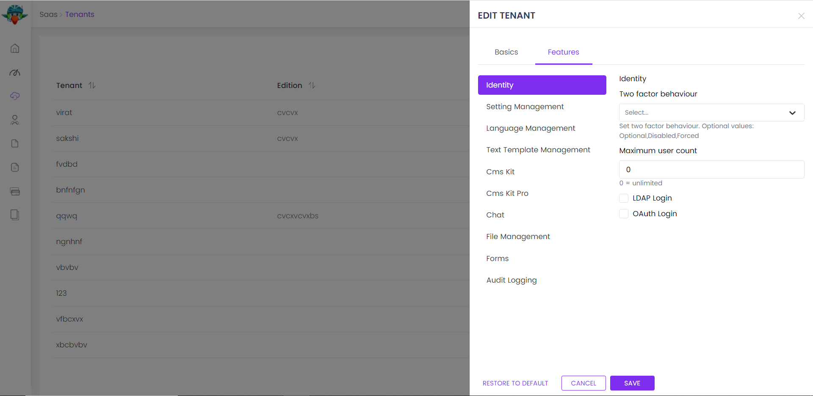
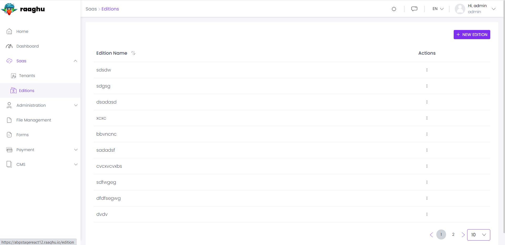
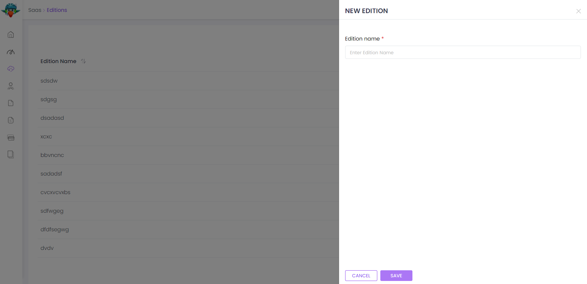

Este ⁇  é usado para gerenciar seus inquilinos e edições em aplicações multi-tenantes;

- Gerencie inquilinos e edições no sistema. Um inquilino pode ter uma edição.
- Definir características de inquilinos.
- Definir ⁇  de inquilinos.
- Definir características de edições e inquilinos.

Ver[a página da ⁇  do ⁇](https://commercial.abp.io/modules/Volo.Saas "")para uma visão geral dos recursos do ⁇ .
## pacotes
Este ⁇  ⁇  a[guia de melhores práticas de desenvolvimento de ⁇](https://docs.abp.io/en/abp/latest/Best-Practices/Index "")e ⁇  de vários pacotes de NuGet e PM. Consulte o guia se você ⁇  ⁇  os pacotes e as ⁇  entre eles.

Você pode visitar[Página de lista de pacotes de ⁇  Saad](https://abp.io/packages?moduleName=Volo.Saas "")para ver a lista de pacotes relacionados com este ⁇ .
### subscrição de inqu ⁇
Módulo Saad implementa assinando Edições para Tenantes usando o ⁇  de Pagamento. Para ativá-lo, o projeto deve conter Volo.Saas e Volo.Payment ⁇  e estes ⁇  devem ser configurados como ⁇  abaixo.
### configuração
Em primeiro lugar, o ⁇  de pagamento deve ser configurado ⁇ :

- Instalar Volo.Payment ⁇ .

      abp add-module Volo.Payment

Ou você pode instalar usando o BP Suite.

- Configure Saas ⁇  para usar o Pagamento.

      Configure(options =&gt;
      {
      options.IsPaymentSupported = true;
      });

- Seguir[assinaturas](https://docs.abp.io/en/commercial/7.0/modules/payment#subscriptions "")⁇  de[Documentação do Módulo de Pagamento](https://docs.abp.io/en/commercial/7.0/modules/payment#subscriptions ""). Completo[que permite ebooks](https://docs.abp.io/en/commercial/7.0/modules/payment#enabling-webhooks "")[planos de configuração](https://docs.abp.io/en/commercial/7.0/modules/payment#configuring-plans "")seções.
- Execute o aplicativo e vá para Saas  ⁇  Edições página no seu menu Web Application.
- Crie ou Edite uma edição existente. Plan dropdown deve ser ⁇  se você fez os ⁇  ⁇  ⁇ . Escolha um plano para a edição.

### uso
O ⁇  Saad não ⁇  uma página de lista de inspeção pública para listar edições para novos clientes/tenants se inscreverem. Primeiro, você precisa ⁇  tal página em sua ⁇ . Em seguida, quando um novo cliente/tenant ⁇  uma ⁇  Edições, você pode ⁇  uma subscrição e redirecionar o ⁇  para o ⁇  de pagamento como ⁇  abaixo.

- Insect ISubscriptionAppService para ⁇  uma subscrição para uma edição:

      public class IndexModel : PageModel
      {
      protected ISubscriptionAppService SubscriptionAppService { get; }
    
      protected ICurrentTenant CurrentTenant { get; }
    
      public IndexModel(
      ISubscriptionAppService subscriptionAppService,
      ICurrentTenant currentTenant)
      {
      SubscriptionAppService = subscriptionAppService;
      CurrentTenant = currentTenant;
      }
    
      public async Task OnPostAsync(Guid editionId)
      {
      var paymentRequest = await SubscriptionAppService.CreateSubscriptionAsync(editionId, CurrentTenant.GetId());
    
      return LocalRedirectPreserveMethod("/Payment/GatewaySelection?paymentRequestId=" + paymentRequest.Id);
      }
      }

Quando o pagamento for ⁇  com sucesso, a relação de inquilino e edição será atualizada de acordo com o status de ⁇ . Certifique-se de Ganchos Gateway Web são configurados ⁇ .

Afinal, o ⁇  de pagamento irá redirecionar o ⁇  para o callbackUrl se configurado em[configuração de pagamento](https://docs.abp.io/en/commercial/7.0/modules/payment#paymentweboptions "")com um ⁇  pagamentoRequestId. Nesta página, você pode ⁇  o status do pedido de pagamento e mostrar uma mensagem de sucesso ao ⁇  quando o status de pagamento for especificado. Uma vez que a ⁇  de pagamento é assíncrona, você precisa ⁇  o status de pagamento repetidamente até que seja ⁇ .
### interface de ⁇
#### itens de menu
O ⁇  Saad adiciona os seguintes itens ao menu "Main", sob o item de menu "Administração":

- **Tenants: Tenant página de gestão.**
- **Edições: Página de ⁇  da edição.**

As classes SaasHostMenuNames e SaasTenantMenuNames ⁇  as constantes para os nomes dos itens do menu.
### páginas
Gestão de inquilinos

A página de inquilinos é usada para administrar inquilinos no sistema.

Você pode ⁇  um novo inquilino ou editar um inquilino nesta página:

### string de ⁇
Você pode gerenciar a string de ⁇  de um inquilino no caso de você ⁇  usar um banco de dados ⁇  para um inquilino específico. Se você ⁇  usar o banco de dados Host para um inquilino, ⁇  "Use o banco de dados compartilhado" ⁇ .

Você também pode usar o recurso de ⁇  de banco de dados específico do ⁇ . Neste caso, você deve ⁇  a ⁇  "Use module específico de ⁇  de banco de dados", então você pode ⁇  seus ⁇  e suas ⁇  de ⁇ . Antes de ⁇  você pode ⁇  sua ⁇  clicando em "Confirmar"
### características de inquilinos
Você pode definir características de inquilinos.

Gerenciamento de edição

A página de edições é usada para gerenciar as edições em seu sistema.

Você pode ⁇  uma nova edição ou editar uma edição existente nesta página:

### características da edição
Você pode definir as características de uma edição nesta página:

