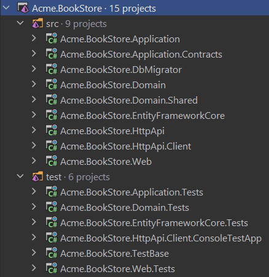
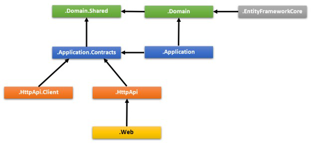
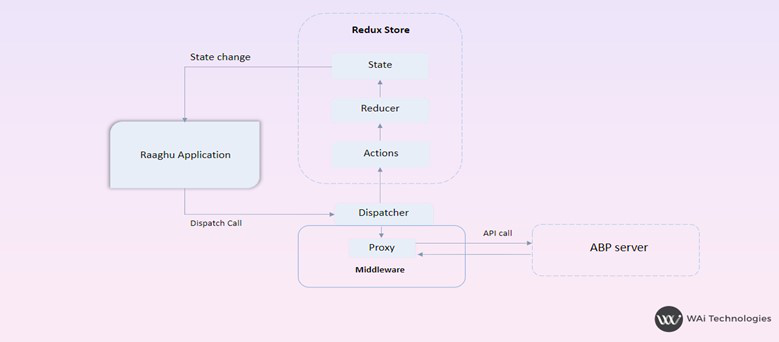
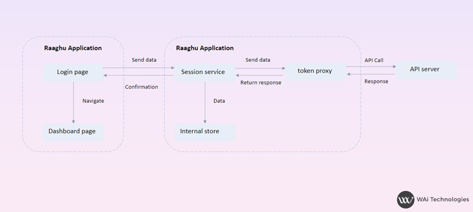
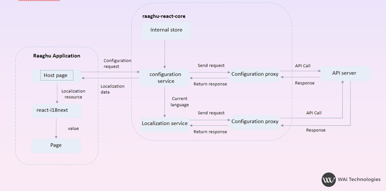
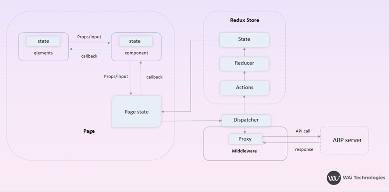

# estrutura de ⁇
Você ⁇  uma estrutura de ⁇  ligeiramente diferente, com base nas ⁇  que você aprendeu.
## estrutura padrão
Se você não especificar qualquer ⁇  adicional, você ⁇  uma ⁇  na pasta gast-core como a abaixo:

Os projetos estão ⁇  em pastas gast-core/src e gast-core/test. ⁇  a pasta gasto-core/src ⁇  a ⁇  real, a pasta gasto-core/test ⁇  testes unitários e projetos de base de teste. O diagrama abaixo mostra as camadas &amp; as dependências do projeto da ⁇ :

Cada ⁇  abaixo ⁇  o projeto relacionado e suas dependências.
### *.domain.shared projeto
Este projeto ⁇  constantes, gêneros e outros objetos que fazem parte da ⁇  de ⁇ , mas compartilhados em todos os projetos na ⁇ .

Por exemplo BookType ou BookConsts (contém constantes de validação como MaxNameLength) são bons candidatos a estar no *.Domain. projeto compartilhado.
### dependências:

- Domain.Shared projeto não tem dependência para outros projetos na ⁇ . Todos os outros projetos dependem ⁇  diretamente ou indiretamente.

### *.projecto de ⁇
Esta é a ⁇  de ⁇  da ⁇ . Contém[entidades,](https://docs.abp.io/en/abp/latest/Entities "") [raizes agregadas,](https://docs.abp.io/en/abp/latest/Entities "") [⁇  de ⁇ ,](https://docs.abp.io/en/abp/latest/Domain-Services "") [tipos de valor,](https://docs.abp.io/en/abp/latest/Value-Types "") [interfaces de repositório](https://docs.abp.io/en/abp/latest/Repositories "")e outros objetos de ⁇ .

Uma ⁇  do Livro, um serviço de ⁇  de BookManager e uma interface IBookRepository são bons ⁇  para estar dentro do projeto *.Domain.
### dependências:

- ⁇  do *.Domain.Shared porque usa constantes, gênero e outros objetos ⁇  nesse projeto.

### *.application.contratos do projecto
Este projeto ⁇  interfaces de serviço de ⁇  e objetos de ⁇  de dados (TO) da ⁇  de ⁇ . Ele separa a interface &amp; ⁇  da ⁇  de ⁇ . Desta forma, o projeto de interface pode ser compartilhado aos clientes como um ⁇  de contrato.

Interface do IBookAppService e BookCreationA classe do BookCreationDto são bons ⁇  para estar dentro do *.Aplicação.
### dependências:

- ⁇  do *.Domain.Shared porque pode usar constantes, gênero e outros objetos compartilhados deste projeto nas interfaces de serviço de ⁇  e Faz.

### *.projecto de ⁇
Este projecto ⁇[serviço de ⁇](https://docs.abp.io/en/abp/latest/Application-Services "")implementações das interfaces ⁇  no projeto .Application.Contratos.

BookAppService é a ⁇  da interface IBookAppService e bons ⁇  para estar dentro do projeto *.Application .
### dependências:

- ⁇  do *.Aplicação.Contrata projeto para ser ⁇  de ⁇  as interfaces e usar o Faz.
- ⁇  do projeto *.Domain para ser ⁇  de usar objetos de ⁇  como entidades, interfaces de repositório, etc... para ⁇  a ⁇  da ⁇ .

### *.entityframeworkcore projeto
Este é o projeto de ⁇  do En Core. Ele define os DbContext e implementa interfaces de repositório ⁇  no projeto *.Domain.
### dependências:

- ⁇  do projeto *.Domain para ser ⁇  de referência a entidades e interfaces de repositório.

Este projeto só está disponível se você estiver usando o En Core como o provedor de banco de dados. Se você ⁇  outro provedor de banco de dados, seu nome será diferente.
### *. projeto de dbmigrator
Esta é uma ⁇  de console que simplifica a ⁇  de migrações de banco de dados em ambientes de desenvolvimento e produção. Quando você executa esta ⁇ , ela;

- Cria o banco de dados, se necessário.
- Aplicar as migrações pendentes do banco de dados.
- Seeds dados iniciais, se necessário.

Observe que este projeto tem seu ⁇  arquivo appsettings.son. Se você precisa alterar a string de ⁇  padrão do banco de dados, você deve configurá-lo em seus ⁇  appsettings.son .

Os dados iniciais de semeadura são importantes neste momento. A BP tem uma ⁇  modular de ⁇  de dados. Mais informações ver[⁇  de ⁇  de dados.](https://docs.abp.io/en/abp/latest/Data-Seeding "")

Ao ⁇  banco de dados e migrações ⁇  apenas ⁇  para ⁇  relacionais, este projeto está ⁇  mesmo se você ⁇  um NoSQL provedor de banco de dados (como MongoDB). Nesse caso, ainda semeia os dados iniciais ⁇  para a inicialização da ⁇ .
### dependências:

- ⁇  do projeto *.EntityFrameworkCore (para En Core) uma vez que precisa de acesso às migrações.
- ⁇  do *.Aplicação.Contrata o projeto para ser ⁇  de ⁇  ⁇  ⁇ , porque os dados iniciais semeados ⁇  todas as permissões para o papel de ⁇  por padrão.

### *.httpapi projeto
Este projeto é usado para definir seus API Controladores.

Na maioria das vezes você não precisa definir ⁇  API Controladores desde o BP's[Auto API Controladores](https://docs.abp.io/en/abp/latest/API/Auto-API-Controllers "")o recurso ⁇ -os ⁇  com base na sua ⁇  de ⁇ . No entanto, no caso de, você precisa escrever API controladores, este é o melhor lugar para ⁇ -lo.
### dependências:

- ⁇  do *.Aplicação.Contrata projeto para ser ⁇  de injetar as interfaces de serviço de ⁇ .

### *.httpapi.client project
Este é o projeto define proxies do cliente C ⁇  para usar o HTTP APIs da ⁇ . Você pode compartilhar esta biblioteca para clientes de 3a ⁇ , para que eles podem facilmente consumir seu HTTP APIs em seus .NET aplicativos. Para outros tipos de aplicações, eles ainda podem usar o APIs, seja ⁇  ou usando uma ⁇  em sua ⁇  plataforma.

A maior parte do tempo você não precisa ⁇  ⁇  proxies do cliente C ⁇ , ⁇  à BP's[Dynamic C ⁇  API Clientes ⁇ .](https://docs.abp.io/en/abp/latest/API/Dynamic-CSharp-API-Clients "")

*.HttpApi.Client.ConsoleTestApp é uma ⁇  de console ⁇  para ⁇  o uso dos proxies do cliente.

- ⁇  do *.Aplicação.Contrata o projeto para poder compartilhar as ⁇  interfaces de serviço de ⁇  e Faz com o serviço remoto.

Observe que, você pode ⁇  este projeto e dependências se você não precisa ⁇  proxies do cliente C ⁇  para seu APIs
### *.web projeto
Este projeto ⁇  a interface de ⁇  (I) do aplicativo se você estiver usando SP.ET Core VC I. Contém páginas Razor, JavaScript arquivos, CSS arquivos, imagens e assim por diante...

Este projeto tem um arquivo appsettings.son que ⁇  a string de ⁇  e outra configuração da ⁇ .
### dependências:

- ⁇  do *.HttpApi desde que a ⁇  UI precisa usar APIs e interfaces de serviço de ⁇  da ⁇ .

Se você ⁇  o código fonte do arquivo *.Web.csproj, você ⁇  as ⁇  aos projetos *.Application e *.EntityFrameworkCore. Estas ⁇  não são realmente ⁇  durante a codificação da sua ⁇  de UI camadas, porque a ⁇  de UI camadas não depende da En Core ou da ⁇  da ⁇  de ⁇ . Este modelo de inicialização é pré-configurado para a ⁇  em camadas, onde API ⁇  é hospedada em um servidor ⁇ , além da UI ⁇ .

No entanto, se você não ⁇  a ⁇  --tiered quando você cria uma ⁇ , estas ⁇  estarão no projeto *.Web para ser ⁇  de hospedar as camadas Web, API e de ⁇  em um único ponto de ⁇ . Isso dá-lhe a ⁇  de usar as entidades de ⁇  e repositórios na sua ⁇  de apresentação. No entanto, esta é considerada uma má ⁇  de acordo com as regras DD.
### reagem arquitetura
Seguem-se a arquitetura sobre como raaghu-react está sendo usado como parte de UI aplicações

### raaghu - ⁇  de autenticação (página de login)

### raaghu - localização

### raaghu - ⁇  da página

### o que se segue?

- [Começando](Getting-Started.html "")documento para ⁇  uma nova ⁇  e executá-la para este modelo.

