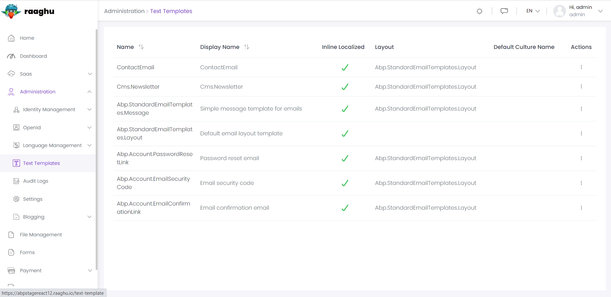
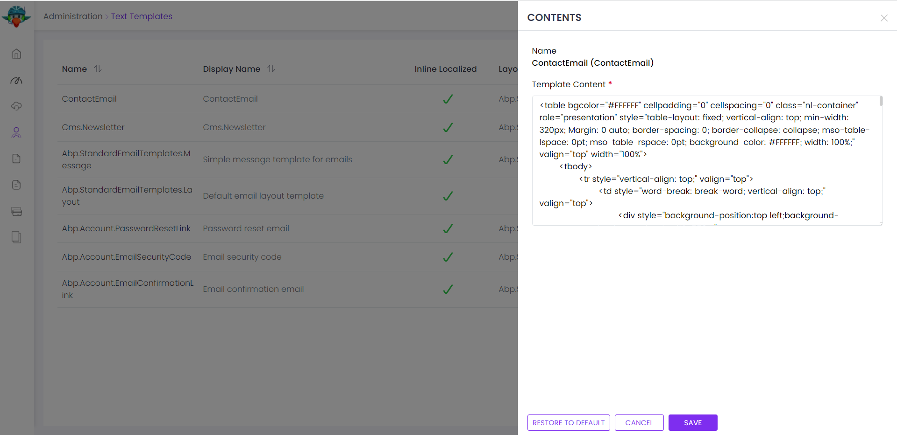

# ⁇  de ⁇  de modelo de texto
Este ⁇  é usado para ⁇  e editar conteúdo do modelo para[o sistema tentador de texto](https://docs.abp.io/en/abp/latest/Text-Templating "")do quadro BP. ⁇ , você pode ⁇  entendê-lo para melhor ⁇  o propósito deste ⁇ .

Há diferentes casos de uso do sistema tentador de texto. Por exemplo,[o Módulo de Conta](https://docs.abp.io/en/commercial/7.0/modules/Account "")está usando-o para definir modelos para enviar e-mails quando ele precisa enviar e-mails para usuários (como enviar "link de redefinição de senha"). Este ⁇  ⁇  que eu facilmente editar esses modelos de e-mail.

Ver[a página da ⁇  do ⁇](https://commercial.abp.io/modules/Volo.TextTemplateManagement "")para uma visão geral dos recursos do ⁇ .
## interface de ⁇
### itens de menu
O ⁇  de ⁇  do modelo de texto adiciona os seguintes itens ao menu "Main", sob o item do menu "Administração":

- **Text Templates: List, visualizar e filtrar modelos de texto.**

TextTemplateManagementMainMenuNames class tem as constantes para os nomes dos itens do menu.
### páginas
Text Templates

Text Templates página é usada para visualizar a lista de modelos ⁇  na ⁇ .

Clique para as Ações - ⁇  Editar Conteúdo para editar conteúdo para um modelo. Existem dois tipos de UI para editar um conteúdo de modelo:

