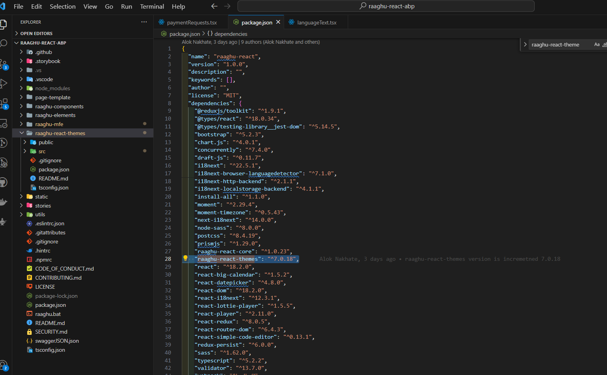
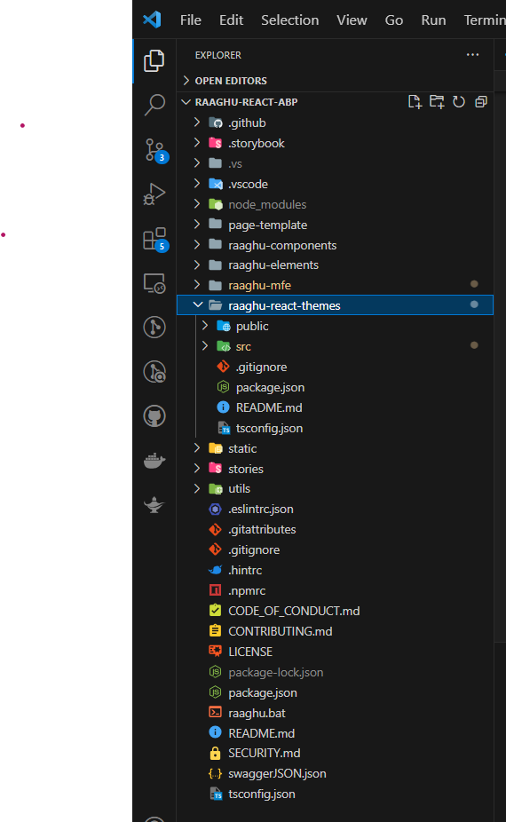
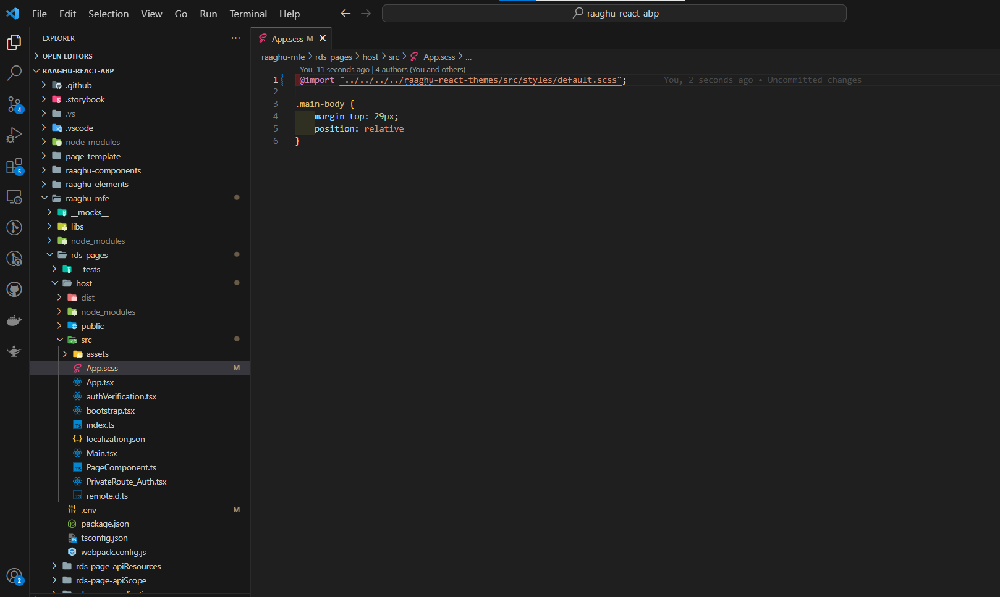
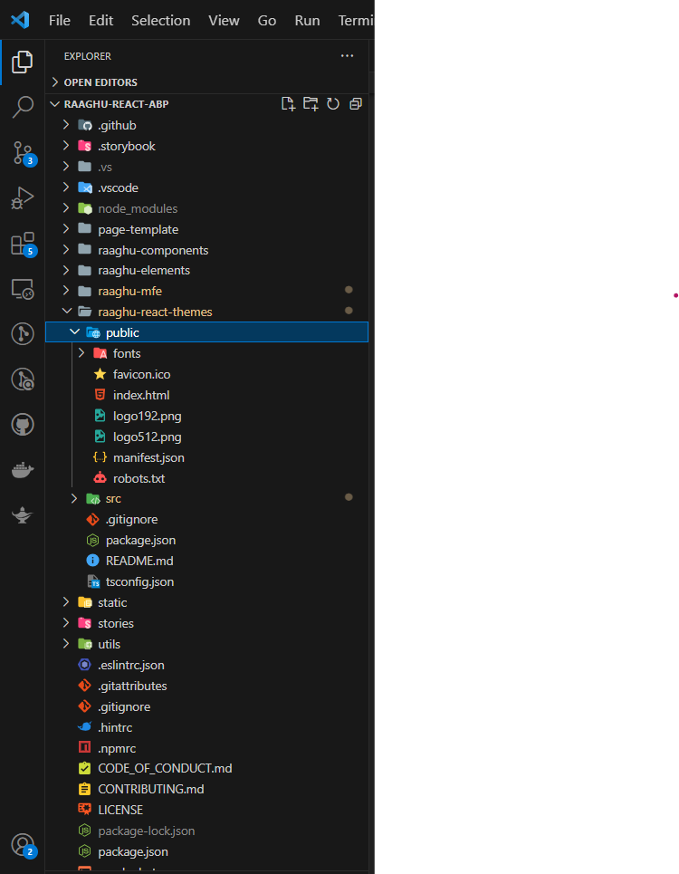
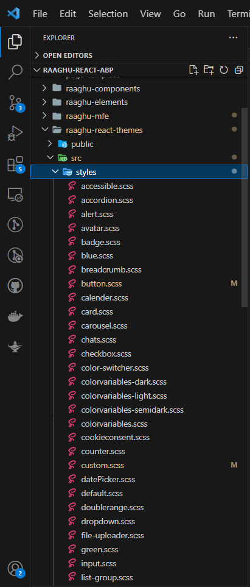

# tema de reagem de raaghu
**Raghu React Theme está pré-instalado no código fonte. ⁇ , não é preciso instalá-lo imediatamente. npm package é ⁇  diretamente no nível do projeto como você ⁇  no arquivo root level.son e dentro da pasta raaghumfe.**

    npm i raaghu-react-themes

# customize raaghu reage tema
### como usar raaghu-react-temas
obter código fonte do repositório, colocar no ⁇  de nível raiz do projeto.

Na pasta seguinte, você vai encontrar todo o Raghu React Theme.

### nível do projeto
Passos a seguir se você deseja personalizar css , cor-variáveis , ⁇  novas classes de acordo com seu tema personalizar.

No nível da raiz você vai ver a pasta raaghu-me dentro que ir para

    rds-pages &gt; host &gt; src &gt; App.scss

você vai conseguir ver a linha abaixo

    @import "../../../../raaghu-react-themes/src/styles/default.scss";

usando a linha acima você pode ⁇  a pasta raaghu-react-themes como você está adicionando todas as coisas relacionadas temas através do arquivo default.css no tema que é por isso que estamos apontando para o arquivo default.css.

Dentro de raaghu-react-temas você vai conseguir ver duas pastas como Public e src

Se você ⁇  fazer ⁇  para ⁇  você pode ir para a pasta de ⁇  dentro da pasta pública -

Se você ⁇  personalizar o elemento css para a ⁇ , você pode ir para a pasta de estilos dentro da pasta src -

